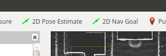

# Carla Spawn Objects

[`carla_spawn_objects` 패키지](https://github.com/carla-simulator/ros-bridge/tree/master/carla_spawn_objects)는 액터(차량, 센서, 보행자)를 스폰하고 센서를 액터에 부착하는 데 사용됩니다.

- [__설정 및 센서 구성__](#설정-및-센서-구성)
    - [설정 생성](#설정-생성)
- [__차량 스폰__](#차량-스폰)
    - [차량 리스폰](#차량-리스폰)
- [__센서 스폰__](#센서-스폰)
    - [기존 차량에 센서 부착](#기존-차량에-센서-부착)

---

## 설정 및 센서 구성

객체와 부착된 센서는 `.json` 파일을 통해 정의됩니다. 이 파일의 기본 위치는 `carla_spawn_objects/config/objects.json`입니다. 위치를 변경하려면 패키지를 시작할 때 비공개 ROS 파라미터 `objects_definition_file`을 통해 파일 경로를 전달합니다:

```sh
# ROS 1
roslaunch carla_spawn_objects carla_spawn_objects.launch objects_definition_file:=경로/objects.json

# ROS 2
ros2 launch carla_spawn_objects carla_spawn_objects.launch.py objects_definition_file:=경로/objects.json
```

### 설정 생성

[ros-bridge 저장소][objectsjson]에서 예제를 찾을 수 있으며, 다음 개요를 따라 자신만의 설정 및 센서 구성을 만들 수 있습니다:

```json
{
"objects":
    [
        {
            "type": "<센서-타입>",
            "id": "<이름>",
            "spawn_point": {"x": 0.0, "y": 0.0, "z": 0.0, "roll": 0.0, "pitch": 0.0, "yaw": 0.0},
            <추가-센서-속성>
        },
        {
            "type": "<차량-타입>",
            "id": "<차량-이름>",
            "spawn_point": {"x": -11.1, "y": 138.5, "z": 0.2, "roll": 0.0, "pitch": 0.0, "yaw": -178.7},
            "sensors":
                [
                <차량에-부착할-센서>
                ]
        }
        ...
    ]
}
```

!!! 주의
    위치를 직접 정의할 때 ROS는 [오른손 좌표계](https://www.ros.org/reps/rep-0103.html#chirality)를 사용한다는 점을 기억하십시오.

모든 센서 속성은 [블루프린트 라이브러리](https://carla.readthedocs.io/en/latest/bp_library/)에 설명된 대로 정의됩니다.

[objectsjson]: https://github.com/carla-simulator/ros-bridge/blob/master/carla_spawn_objects/config/objects.json

---

## 차량 스폰

- 특정 스폰 지점이 정의되지 않은 경우, 차량은 무작위 위치에 스폰됩니다.
- 차량이 스폰될 위치를 정의하는 방법에는 두 가지가 있습니다:

    - 원하는 위치를 ROS 파라미터 `spawn_point_<차량-이름>`에 전달합니다. `<차량-이름>`은 `.json` 파일에서 차량에 부여한 `id`가 됩니다:

            # ROS 1
            roslaunch carla_spawn_objects carla_spawn_objects.launch spawn_point_<차량-이름>:=x,y,z,roll,pitch,yaw

            # ROS 2
            ros2 launch carla_spawn_objects carla_spawn_objects.launch.py spawn_point_<차량-이름>:=x,y,z,roll,pitch,yaw

    - 초기 위치를 `.json` 파일에 직접 정의합니다:

            {
            "type": "vehicle.*",
            "id": "ego_vehicle",
            "spawn_point": {"x": -11.1, "y": 138.5, "z": 0.2, "roll": 0.0, "pitch": 0.0, "yaw": -178.7},
            }

### 차량 리스폰

시뮬레이션 중에 차량을 다른 위치로 리스폰하려면 `/carla/<ROLE NAME>/<CONTROLLER_ID>/initialpose` 토픽에 발행합니다. 이 기능을 사용하려면:

1. `.json` 파일에서 차량에 `actor.pseudo.control` 의사 액터를 부착합니다. 이 액터의 `id` 값은 토픽에 발행하는 데 사용된 `<CONTROLLER_ID>` 값과 동일해야 합니다:

        {
        "type": "vehicle.*",
        "id": "ego_vehicle",
        "sensors":
        [
            {
            "type": "actor.pseudo.control",
            "id": "control"
            }
        ]
        }

2. `<CONTROLLER_ID>`를 ROS 파라미터 `controller_id`(기본값 = 'control')의 인수로 전달하여 `set_inital_pose` 노드를 시작합니다:

        roslaunch carla_spawn_objects set_initial_pose.launch controller_id:=<CONTROLLER_ID>

3. 새 위치를 설정하는 메시지를 발행하는 선호되는 방법은 RVIZ 인터페이스에서 사용 가능한 __2D Pose Estimate__ 버튼을 사용하는 것입니다. 그런 다음 맵의 뷰포트를 클릭하여 해당 위치에 리스폰할 수 있습니다. 이렇게 하면 현재 `ego_vehicle`이 삭제되고 지정된 위치에 다시 스폰됩니다.

> 

---

## 센서 스폰

- 센서의 초기 위치는 차량과 마찬가지로 `.json` 파일에 직접 정의해야 합니다.
- 차량에 부착된 센서의 스폰 지점은 차량을 기준으로 상대적으로 간주됩니다.

### 기존 차량에 센서 부착

이미 존재하는 차량에 센서를 부착할 수 있습니다. 그렇게 하려면:

1. `.json` 파일에 `sensor.pseudo.actor_list` 의사 센서를 정의합니다. 이렇게 하면 이미 존재하는 액터 목록에 접근할 수 있습니다.

        ...
        {
            "type": "sensor.pseudo.actor_list",
            "id": "actor_list"
        },

2. 나머지 센서를 필요에 따라 정의합니다.
3. `spawn_sensors_only` 파라미터를 True로 설정하여 노드를 시작합니다. 이렇게 하면 `.json` 파일에 지정된 것과 동일한 `id` 및 `type`을 가진 액터가 이미 활성 상태인지 확인하고, 그렇다면 이 액터에 센서를 부착합니다.

        # ROS 1
        roslaunch carla_spawn_objects carla_spawn_objects.launch spawn_sensors_only:=True

        # ROS 2
        ros2 launch carla_spawn_objects carla_spawn_objects.launch.py spawn_sensors_only:=True