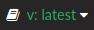
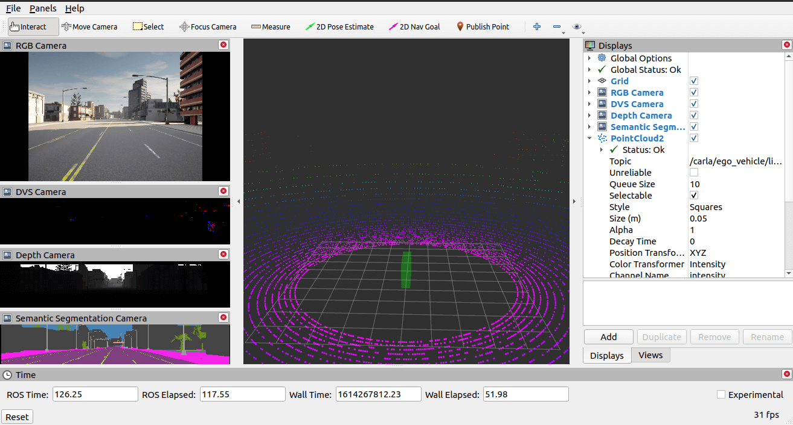
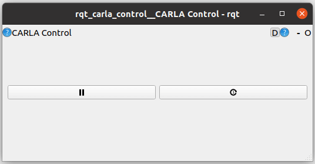

---

**파일: carla_ad_agent_ko.md**

```markdown
# CARLA AD 에이전트

[CARLA AD 에이전트](https://github.com/carla-simulator/ros-bridge/tree/master/carla_ad_agent)는 주어진 경로를 따라가고, 다른 차량과의 충돌을 피하며, 그라운드 트루스 데이터에 접근하여 신호등 상태를 준수할 수 있는 AD(자율 주행) 에이전트입니다. [CARLA AD 데모](carla_ad_demo_ko.md)에서 ROS 브리지를 사용하는 방법의 예시를 제공하기 위해 사용됩니다.

- [__요구 사항__](#요구-사항)
- [__ROS API__](#ros-api)
    - [__AD 에이전트 노드__](#ad-에이전트-노드)
        - [파라미터](#파라미터)
        - [구독 (Subscriptions)](#구독-subscriptions)
        - [발행 (Publications)](#발행-publications)
    - [__로컬 플래너 노드__](#로컬-플래너-노드)
        - [파라미터](#파라미터-1)
        - [구독 (Subscriptions)](#구독-subscriptions-1)
        - [발행 (Publications)](#발행-publications-1)

내부적으로 CARLA AD 에이전트는 [로컬 플래닝](https://github.com/carla-simulator/ros-bridge/blob/ros2/carla_ad_agent/src/carla_ad_agent/local_planner.py)을 위한 별도의 노드를 사용합니다. 이 노드는 기어 변속 지연이 없는 `vehicle.tesla.model3`에 최적화되어 있습니다.

PID 파라미터는 [Ziegler-Nichols 방법](https://en.wikipedia.org/wiki/Ziegler%E2%80%93Nichols_method)을 통해 수집되었습니다.

---

## 요구 사항

`carla_ad_agent`를 사용하려면 최소한의 센서 세트를 스폰해야 합니다 ([Carla Spawn Objects](carla_spawn_objects_ko.md)에서 센서 스폰 방법에 대한 정보 참조):

- 차량에 부착된 `odometry` 역할 이름(role-name)을 가진 오도메트리 의사 센서 (`sensor.pseudo.odom`).
- 차량에 부착된 `objects` 역할 이름을 가진 객체 의사 센서 (`sensor.pseudo.objects`).
- `traffic_lights` 역할 이름을 가진 신호등 의사 센서 (`sensor.pseudo.traffic_lights`).

---

## ROS API

### AD 에이전트 노드

#### 파라미터

| 파라미터     | 타입                | 설명                             |
|--------------|---------------------|----------------------------------|
| `role_name`  | string (기본값: `ego_vehicle`) | 에고 차량의 CARLA 역할 이름      |
| `avoid_risk` | bool (기본값: `true`)   | True이면 다른 차량과의 충돌을 피하고 신호등을 준수합니다 |

<br>

#### 구독 (Subscriptions)

| 토픽                           | 타입                                                                                      | 설명                               |
|--------------------------------|-------------------------------------------------------------------------------------------|------------------------------------|
| `/carla/<ROLE NAME>/target_speed` | [std_msgs/Float64](https://docs.ros.org/en/api/std_msgs/html/msg/Float64.html)             | 에고 차량의 목표 속도              |
| `/carla/<ROLE NAME>/odometry`     | [nav_msgs/Odometry](https://docs.ros.org/en/api/nav_msgs/html/msg/Odometry.html)           | 에고 차량의 오도메트리             |
| `/carla/<ROLE NAME>/vehicle_info` | [carla_msgs/CarlaEgoVehicleInfo](ros_msgs_ko.md#carlaegovehicleinfomsg)                   | 에고 차량의 CARLA 액터 ID 식별     |
| `/carla/<ROLE NAME>/objects`      | [derived_object_msgs/ObjectArray](https://docs.ros.org/en/melodic/api/derived_object_msgs/html/msg/ObjectArray.html) | 다른 액터에 대한 정보            |
| `/carla/traffic_lights/status`  | [carla_msgs/CarlaTrafficLightStatusList](ros_msgs_ko.md#carlatrafficlightstatuslistmsg) | 현재 신호등 상태 가져오기        |
| `/carla/traffic_lights/info`    | [carla_msgs/CarlaTrafficLightInfoList](ros_msgs_ko.md#carlatrafficlightinfolistmsg)   | 신호등 정보 가져오기             |

<br>

#### 발행 (Publications)

| 토픽                           | 타입                                                                                      | 설명       |
|--------------------------------|-------------------------------------------------------------------------------------------|------------|
| `/carla/<ROLE NAME>/speed_command` | [std_msgs/Float64](https://docs.ros.org/en/api/std_msgs/html/msg/Float64.html)             | 목표 속도  |

<br>

### 로컬 플래너 노드

#### 파라미터

| 파라미터           | 타입                | 설명                                 |
|--------------------|---------------------|--------------------------------------|
| `role_name`        | string (기본값: `ego_vehicle`) | 에고 차량의 CARLA 역할 이름          |
| `control_time_step`| float (기본값: `0.05`)   | 제어 루프 속도                       |
| `Kp_lateral`       | float (기본값: `0.9`)    | 횡방향 PID 컨트롤러의 비례(P) 항     |
| `Ki_lateral`       | float (기본값: `0.0`)    | 횡방향 PID 컨트롤러의 적분(I) 항     |
| `Kd_lateral`       | float (기본값: `0.0`)    | 횡방향 PID 컨트롤러의 미분(D) 항     |
| `Kp_longitudinal`  | float (기본값: `0.206`)  | 종방향 PID 컨트롤러의 비례(P) 항     |
| `Ki_longitudinal`  | float (기본값: `0.0206`) | 종방향 PID 컨트롤러의 적분(I) 항     |
| `Kd_longitudinal`  | float (기본값: `0.515`)  | 종방향 PID 컨트롤러의 미분(D) 항     |

<br>

#### 구독 (Subscriptions)

| 토픽                           | 타입                                                                                      | 설명                 |
|--------------------------------|-------------------------------------------------------------------------------------------|----------------------|
| `/carla/<ROLE NAME>/waypoints`    | [nav_msgs/Path](https://docs.ros.org/en/api/nav_msgs/html/msg/Path.html)                 | 따라갈 경로          |
| `/carla/<ROLE NAME>/odometry`     | [nav_msgs/Odometry](https://docs.ros.org/en/api/nav_msgs/html/msg/Odometry.html)           | 에고 차량의 오도메트리 |
| `/carla/<ROLE NAME>/speed_command` | [std_msgs/Float64](https://docs.ros.org/en/api/std_msgs/html/msg/Float64.html)             | 목표 속도            |

<br>

#### 발행 (Publications)

| 토픽                               | 타입                                                                                              | 설명                   |
|------------------------------------|---------------------------------------------------------------------------------------------------|------------------------|
| `/carla/<ROLE NAME>/next_target`     | [visualization_msgs/Marker](http://docs.ros.org/en/api/visualization_msgs/html/msg/Marker.html) | 다음 목표 포즈 마커    |
| `/carla/<ROLE NAME>/vehicle_control_cmd` | [carla_msgs/CarlaEgoVehicleControl](ros_msgs_ko.md#carlaegovehiclecontrolmsg)                 | 차량 제어 명령         |

<br>
```

---

**파일: carla_ackermann_control_ko.md**

```markdown
# Carla Ackermann Control

[`carla_ackermann_control` 패키지](https://github.com/carla-simulator/ros-bridge/tree/master/carla_ackermann_control)는 [Ackermann 메시지][ackermanncontrolmsg]를 사용하여 CARLA 차량을 제어하는 데 사용됩니다. 이 패키지는 Ackermann 메시지를 [CarlaEgoVehicleControl][carlaegovehiclecontrolmsg] 메시지로 변환합니다. CARLA에서 차량 정보를 읽어와서 `simple-pid`라는 Python 기반 PID 컨트롤러에 전달하여 가속도와 속도를 제어합니다.

[ackermanncontrolmsg]: https://docs.ros.org/en/api/ackermann_msgs/html/msg/AckermannDrive.html
[carlaegovehiclecontrolmsg]: https://carla.readthedocs.io/en/latest/ros_msgs/#carlaegovehiclecontrolmsg

- [__설정__](#설정)
- [__제어 메시지 테스트__](#제어-메시지-테스트)
- [__ROS API__](#ros-api)
    - [구독 (Subscriptions)](#구독-subscriptions)
    - [발행 (Publications)](#발행-publications)

---

### 설정

파라미터는 ROS 1과 ROS 2 모두에서 [설정 파일][ackermanconfig]을 통해 초기에 설정할 수 있으며, ROS 1에서는 런타임 중에 ROS [동적 재구성(dynamic reconfigure)][rosdynamicreconfig]을 통해 설정할 수도 있습니다.

[ackermanconfig]: https://github.com/carla-simulator/ros-bridge/blob/master/carla_ackermann_control/config/settings.yaml
[rosdynamicreconfig]: https://wiki.ros.org/dynamic_reconfigure

---

### 제어 메시지 테스트

`/carla/<ROLE NAME>/ackermann_cmd` 토픽을 통해 차량에 명령을 보내 설정을 테스트합니다. 예를 들어, 역할 이름이 `ego_vehicle`인 에고 차량을 초속 10미터의 속도로 전진시키려면 다음 명령을 실행합니다:

```bash
# ROS 1
rostopic pub /carla/ego_vehicle/ackermann_cmd ackermann_msgs/AckermannDrive "{steering_angle: 0.0, steering_angle_velocity: 0.0, speed: 10, acceleration: 0.0, jerk: 0.0}" -r 10

# ROS 2
ros2 topic pub /carla/ego_vehicle/ackermann_cmd ackermann_msgs/AckermannDrive "{steering_angle: 0.0, steering_angle_velocity: 0.0, speed: 10, acceleration: 0.0, jerk: 0.0}" -r 10
```

또는 차량이 1.22 라디안 각도로 회전하면서 전진하도록 하려면 다음 명령을 실행합니다:

```bash
# ROS 1
rostopic pub /carla/ego_vehicle/ackermann_cmd ackermann_msgs/AckermannDrive "{steering_angle: 1.22, steering_angle_velocity: 0.0, speed: 10, acceleration: 0.0, jerk: 0.0}" -r 10

# ROS 2
ros2 topic pub /carla/ego_vehicle/ackermann_cmd ackermann_msgs/AckermannDrive "{steering_angle: 1.22, steering_angle_velocity: 0.0, speed: 10, acceleration: 0.0, jerk: 0.0}" -r 10
```

---

### ROS API

#### 구독 (Subscriptions)

| 토픽                           | 타입                                              | 설명                      |
|--------------------------------|---------------------------------------------------|---------------------------|
| `/carla/<ROLE NAME>/ackermann_cmd` | [ackermann_msgs.AckermannDrive][ackermanncontrolmsg] | 조향 명령을 위한 __구독자__ |

<br>

#### 발행 (Publications)

| 토픽                                            | 타입                                                                | 설명                                          |
|-------------------------------------------------|---------------------------------------------------------------------|-----------------------------------------------|
| `/carla/<ROLE NAME>/ackermann_control/control_info` | [carla_ackermann_control.EgoVehicleControlInfo][egovehiclecontrolmsg] | 컨트롤러 내에서 현재 사용되는 값 (디버깅에 유용) |

[egovehiclecontrolmsg]: https://carla.readthedocs.io/en/latest/ros_msgs/#egovehiclecontrolinfomsg

<br>
```

---

**파일: carla_ad_demo_ko.md**

```markdown
# CARLA AD 데모

[AD 데모](https://github.com/carla-simulator/ros-bridge/tree/master/carla_ad_demo)는 AD 차량이 포함된 CARLA ROS 환경을 시작하는 데 필요한 모든 것을 제공하는 예제 패키지입니다.

- [__시작하기 전에__](#시작하기-전에)
- [__데모 실행__](#데모-실행)
    - [랜덤 경로](#랜덤-경로)
    - [시나리오 실행](#시나리오-실행)
---

## 시작하기 전에

[Scenario Runner](https://carla-scenariorunner.readthedocs.io/en/latest/getting_scenariorunner/)를 설치하고 Scenario Runner ["시작하기" 튜토리얼](https://github.com/carla-simulator/scenario_runner/blob/master/Docs/getting_started.md)을 따라 제대로 작동하는지 확인합니다.

Scenario Runner 설치 경로를 찾기 위해 환경 변수를 설정합니다:

```sh
export SCENARIO_RUNNER_PATH=<scenario_runner_경로>
```

---

## 데모 실행

#### 랜덤 경로

CARLA 서버를 시작한 후, 에고 차량이 무작위로 생성된 경로를 따라가는 데모를 시작하려면 다음 명령을 실행합니다:

```sh
# ROS 1
roslaunch carla_ad_demo carla_ad_demo.launch

# ROS 2
ros2 launch carla_ad_demo carla_ad_demo.launch.py
```

다른 터미널에서 다음 명령을 실행하여 추가 차량이나 보행자를 스폰할 수도 있습니다:

```sh
cd <CARLA_경로>/PythonAPI/examples/

python3 spawn_npc.py
```

#### 시나리오 실행

미리 정의된 시나리오로 데모를 실행하려면 CARLA 서버를 시작한 후 다음 명령을 실행합니다:

```sh
# ROS 1
roslaunch carla_ad_demo carla_ad_demo_with_scenario.launch

# ROS 2
ros2 launch carla_ad_demo carla_ad_demo_with_scenario.launch.py
```

RVIZ Carla 플러그인 내에서 "FollowLeadingVehicle" 예제 시나리오를 선택하고 "Execute"를 누릅니다. 에고 차량의 위치가 재조정되고 시나리오가 처리됩니다.

`/carla/available_scenarios` 토픽에 발행하여 사용자 정의 시나리오를 지정할 수 있습니다. [launchfile](https://github.com/carla-simulator/ros-bridge/blob/ros2/carla_ad_demo/launch/carla_ad_demo_with_scenario.launch)은 이를 수행하는 방법의 예시를 보여줍니다:

```launch
  <node pkg="rostopic" type="rostopic" name="publish_scenarios"
    args="pub /carla/available_scenarios carla_ros_scenario_runner_types/CarlaScenarioList '{ 'scenarios':
      [
        {
          'name': 'FollowLeadingVehicle',
          'scenario_file': '$(find carla_ad_demo)/config/FollowLeadingVehicle.xosc'
        }
      ]
    }' -l"/>
```

---
```

---

**파일: carla_manual_control_ko.md**

```markdown
# Carla 수동 제어

[CARLA 수동 제어 패키지](https://github.com/carla-simulator/ros-bridge/tree/master/carla_manual_control)는 CARLA와 함께 제공되는 [`manual_control.py`][manualcontrol] 스크립트의 ROS 전용 버전입니다. 모든 데이터는 ROS 토픽을 통해 수신됩니다.

[manualcontrol]: https://github.com/carla-simulator/carla/blob/master/PythonAPI/examples/manual_control.py

- [__요구 사항__](#요구-사항)
- [__패키지 실행__](#패키지-실행)
---

## 요구 사항

`carla_manual_control`을 사용하려면 에고 차량에 특정 센서가 부착되어 있어야 합니다 ([Carla Spawn Objects](carla_spawn_objects_ko.md)에서 차량에 센서를 부착하는 방법 참조):

- __이미지 표시용__: 역할 이름 `rgb_view` 및 해상도 800x600의 카메라.
- __현재 위치 표시용__: 역할 이름 `gnss`의 GNSS 센서 및 역할 이름 `odometry`의 오도메트리 의사 센서.
- __차선 침범 알림용__: 역할 이름 `lane_invasion`의 차선 침범 센서.
- __충돌 알림용__: 역할 이름 `collision`의 충돌 센서.

---

## 패키지 실행

패키지를 실행하려면:

__1.__ CARLA가 실행 중인지 확인합니다. ROS 브리지를 시작합니다:

```sh
        # ROS 1
        roslaunch carla_ros_bridge carla_ros_bridge.launch

        # ROS 2
        ros2 launch carla_ros_bridge carla_ros_bridge.launch.py
```

__2.__ 객체를 스폰합니다:

```sh
        # ROS 1
        roslaunch carla_spawn_objects carla_spawn_objects.launch

        # ROS 2
        ros2 launch carla_spawn_objects carla_spawn_objects.launch.py
```

__3.__ `carla_manual_control` 노드를 시작합니다:

```sh
        # ROS 1
        roslaunch carla_manual_control carla_manual_control.launch

        # ROS 2
        ros2 launch carla_manual_control carla_manual_control.launch.py```

__4.__ 차량을 수동으로 조종하려면 'B' 키를 누릅니다. 지침을 보려면 'H' 키를 누릅니다.

또는, 위의 모든 명령은 별도의 단일 launchfile에 결합되어 있으며 다음을 실행하여 동시에 실행할 수 있습니다:

```sh
        # ROS 1
        roslaunch carla_ros_bridge carla_ros_bridge_with_example_ego_vehicle.launch

        # ROS 2
        ros2 launch carla_ros_bridge carla_ros_bridge_with_example_ego_vehicle.launch.py
```
---
```

---

**파일: carla_ros_scenario_runner_ko.md**

```markdown
# Carla ROS Scenario Runner

[CARLA ROS Scenario Runner 패키지](https://github.com/carla-simulator/ros-bridge/tree/master/carla_ros_scenario_runner)는 ROS를 통해 CARLA [Scenario Runner](https://github.com/carla-simulator/scenario_runner)로 [OpenScenarios](https://www.asam.net/standards/detail/openscenario/)를 실행하기 위한 래퍼(wrapper)입니다.

- [__시작하기 전에__](#시작하기-전에)
- [__ROS Scenario Runner 사용__](#ros-scenario-runner-사용)
- [__ROS Scenario Runner 실행__](#ros-scenario-runner-실행)
- [__ROS API__](#ros-api)
    - [서비스 (Services)](#서비스-services)
    - [발행 (Publications)](#발행-publications)

---

## 시작하기 전에

- Scenario Runner ["시작하기"](https://github.com/carla-simulator/scenario_runner/blob/master/Docs/getting_started.md) 튜토리얼을 따라 Scenario Runner를 설치합니다.
- Python 모듈 __Pexpect__를 설치합니다:

```shell
sudo apt install python-pexpect```
---

## ROS Scenario Runner 사용

ROS Scenario Runner는 [`rviz_carla_plugin`](rviz_plugin_ko.md) 내에서 사용하는 것이 가장 좋습니다.

!!! 주의
    현재 맵 변경은 지원되지 않습니다. 각 시나리오는 현재 활성화된 맵을 사용해야 합니다.

예제 시나리오는 [여기](https://github.com/carla-simulator/ros-bridge/blob/master/carla_ad_demo/config/FollowLeadingVehicle.xosc)에서 찾을 수 있습니다. 특히 중요한 것은 [ROS 컨트롤러](https://github.com/carla-simulator/ros-bridge/blob/master/carla_ad_demo/config/FollowLeadingVehicle.xosc#L78) 설정입니다:

```xml
<Controller name="EgoVehicleAgent">
    <Properties>
        <Property name="module" value="carla_ros_scenario_runner.ros_vehicle_control" />
        <Property name="launch" value="carla_ad_agent.launch"/>
        <Property name="launch-package" value="carla_ad_agent"/>
        <Property name="path_topic_name" value="waypoints"/>
    </Properties>
</Controller>
```

위 코드 예제는 [`carla_ad_agent`](carla_ad_agent_ko.md) 인스턴스가 시작되는 것을 보여줍니다. 추가적인 `<Property>`는 ROS 파라미터(name:=value)로 추가되어야 합니다.

---

## ROS Scenario Runner 실행

__1.__ ROS Scenario Runner 패키지를 실행합니다:

```sh
# ROS 1
roslaunch carla_ros_scenario_runner carla_ros_scenario_runner.launch scenario_runner_path:=<scenario_runner_경로>

# ROS 2
ros2 launch carla_ros_scenario_runner carla_ros_scenario_runner.launch.py scenario_runner_path:=<scenario_runner_경로>
```

__2.__ 시나리오를 실행합니다:

```sh
# ROS 1
rosservice call /scenario_runner/execute_scenario "{ 'scenario': { 'scenario_file': '<openscenario_파일의_전체_경로>' } }"

# ROS 2
ros2 service call /scenario_runner/execute_scenario carla_ros_scenario_runner_types/srv/ExecuteScenario "{ 'scenario': { 'scenario_file': '<openscenario_파일의_전체_경로>' } }"
```

---

## ROS API

### 서비스 (Services)

| 서비스                           | 타입                                                                                                                            | 설명                                                          |
|----------------------------------|---------------------------------------------------------------------------------------------------------------------------------|---------------------------------------------------------------|
| `/scenario_runner/execute_scenario` | [`carla_ros_scenario_runner_types.ExecuteScenario`](https://github.com/carla-simulator/ros-bridge/blob/ros2/carla_ros_scenario_runner_types/srv/ExecuteScenario.srv) | 시나리오를 실행합니다. 다른 시나리오가 현재 실행 중이면 중지됩니다. |

<br>

### 발행 (Publications)

| 토픽                       | 타입                                                                                                                                                   | 설명                                                                     |
|----------------------------|--------------------------------------------------------------------------------------------------------------------------------------------------------|--------------------------------------------------------------------------|
| `/scenario_runner/status`  | [`carla_ros_scenario_runner_types.CarlaScenarioRunnerStatus`](https://github.com/carla-simulator/ros-bridge/blob/ros2/carla_ros_scenario_runner_types/msg/CarlaScenarioRunnerStatus.msg) | 시나리오 러너 실행의 현재 상태 ([rviz_carla_plugin](rviz_plugin_ko.md)에서 사용) |


컨트롤러 `ros_vehicle_control`은 다음 토픽을 제공합니다:
| 토픽                           | 타입                                                                                        | 설명                                                                     |
|--------------------------------|---------------------------------------------------------------------------------------------|--------------------------------------------------------------------------|
| `/carla/<ROLE NAME>/waypoints`    | [`nav_msgs.Path`](https://docs.ros.org/en/api/nav_msgs/html/msg/Path.html)                 | 시나리오 내에 정의된 경로. 참고: 토픽 이름은 `path_topic_name` 파라미터를 수정하여 변경할 수 있습니다 |
| `/carla/<ROLE NAME>/target_speed` | [`std_msgs.Float64`](https://docs.ros.org/en/api/std_msgs/html/msg/Float64.html)             | 시나리오 내에 정의된 목표 속도                                             |

<br>
```

---

**파일: carla_spawn_objects_ko.md**

```markdown
# Carla Spawn Objects

[`carla_spawn_objects` 패키지](https://github.com/carla-simulator/ros-bridge/tree/master/carla_spawn_objects)는 액터(차량, 센서, 보행자)를 스폰하고 센서를 액터에 부착하는 데 사용됩니다.

- [__설정 및 센서 구성__](#설정-및-센서-구성)
    - [설정 생성](#설정-생성)
- [__차량 스폰__](#차량-스폰)
    - [차량 리스폰](#차량-리스폰)
- [__센서 스폰__](#센서-스폰)
    - [기존 차량에 센서 부착](#기존-차량에-센서-부착)

---

## 설정 및 센서 구성

객체와 부착된 센서는 `.json` 파일을 통해 정의됩니다. 이 파일의 기본 위치는 `carla_spawn_objects/config/objects.json`입니다. 위치를 변경하려면 패키지를 시작할 때 비공개 ROS 파라미터 `objects_definition_file`을 통해 파일 경로를 전달합니다:

```sh
    # ROS 1
    roslaunch carla_spawn_objects carla_spawn_objects.launch objects_definition_file:=경로/objects.json

    # ROS 2
    ros2 launch carla_spawn_objects carla_spawn_objects.launch.py objects_definition_file:=경로/objects.json
```


### 설정 생성

[ros-bridge 저장소][objectsjson]에서 예제를 찾을 수 있으며, 다음 개요를 따라 자신만의 설정 및 센서 구성을 만들 수 있습니다:

```json
{
"objects":
    [
        {
            "type": "<센서-타입>",
            "id": "<이름>",
            "spawn_point": {"x": 0.0, "y": 0.0, "z": 0.0, "roll": 0.0, "pitch": 0.0, "yaw": 0.0},
            <추가-센서-속성>
        },
        {
            "type": "<차량-타입>",
            "id": "<차량-이름>",
            "spawn_point": {"x": -11.1, "y": 138.5, "z": 0.2, "roll": 0.0, "pitch": 0.0, "yaw": -178.7},
            "sensors":
                [
                <차량에-부착할-센서>
                ]
        }
        ...
    ]
}
```


!!! 주의
    위치를 직접 정의할 때 ROS는 [오른손 좌표계](https://www.ros.org/reps/rep-0103.html#chirality)를 사용한다는 점을 기억하십시오.

모든 센서 속성은 [블루프린트 라이브러리](https://carla.readthedocs.io/en/latest/bp_library/)에 설명된 대로 정의됩니다.

[objectsjson]: https://github.com/carla-simulator/ros-bridge/blob/master/carla_spawn_objects/config/objects.json

---

## 차량 스폰

- 특정 스폰 지점이 정의되지 않은 경우, 차량은 무작위 위치에 스폰됩니다.
- 차량이 스폰될 위치를 정의하는 방법에는 두 가지가 있습니다:

    - 원하는 위치를 ROS 파라미터 `spawn_point_<차량-이름>`에 전달합니다. `<차량-이름>`은 `.json` 파일에서 차량에 부여한 `id`가 됩니다:

            # ROS 1
            roslaunch carla_spawn_objects carla_spawn_objects.launch spawn_point_<차량-이름>:=x,y,z,roll,pitch,yaw

            # ROS 2
            ros2 launch carla_spawn_objects carla_spawn_objects.launch.py spawn_point_<차량-이름>:=x,y,z,roll,pitch,yaw

    - 초기 위치를 `.json` 파일에 직접 정의합니다:

            {
            "type": "vehicle.*",
            "id": "ego_vehicle",
            "spawn_point": {"x": -11.1, "y": 138.5, "z": 0.2, "roll": 0.0, "pitch": 0.0, "yaw": -178.7},
            }

### 차량 리스폰

시뮬레이션 중에 차량을 다른 위치로 리스폰하려면 `/carla/<ROLE NAME>/<CONTROLLER_ID>/initialpose` 토픽에 발행합니다. 이 기능을 사용하려면:

1. `.json` 파일에서 차량에 `actor.pseudo.control` 의사 액터를 부착합니다. 이 액터의 `id` 값은 토픽에 발행하는 데 사용된 `<CONTROLLER_ID>` 값과 동일해야 합니다:

        {
        "type": "vehicle.*",
        "id": "ego_vehicle",
        "sensors":
        [
            {
            "type": "actor.pseudo.control",
            "id": "control"
            }
        ]
        }

2. `<CONTROLLER_ID>`를 ROS 파라미터 `controller_id`(기본값 = 'control')의 인수로 전달하여 `set_inital_pose` 노드를 시작합니다:

        roslaunch carla_spawn_objects set_initial_pose.launch controller_id:=<CONTROLLER_ID>

3. 새 위치를 설정하는 메시지를 발행하는 선호되는 방법은 RVIZ 인터페이스에서 사용 가능한 __2D Pose Estimate__ 버튼을 사용하는 것입니다. 그런 다음 맵의 뷰포트를 클릭하여 해당 위치에 리스폰할 수 있습니다. 이렇게 하면 현재 `ego_vehicle`이 삭제되고 지정된 위치에 다시 스폰됩니다.

> 

---

## 센서 스폰

- 센서의 초기 위치는 차량과 마찬가지로 `.json` 파일에 직접 정의해야 합니다.
- 차량에 부착된 센서의 스폰 지점은 차량을 기준으로 상대적으로 간주됩니다.

### 기존 차량에 센서 부착

이미 존재하는 차량에 센서를 부착할 수 있습니다. 그렇게 하려면:

1. `.json` 파일에 `sensor.pseudo.actor_list` 의사 센서를 정의합니다. 이렇게 하면 이미 존재하는 액터 목록에 접근할 수 있습니다.

        ...
        {
            "type": "sensor.pseudo.actor_list",
            "id": "actor_list"
        },

2. 나머지 센서를 필요에 따라 정의합니다.
3. `spawn_sensors_only` 파라미터를 True로 설정하여 노드를 시작합니다. 이렇게 하면 `.json` 파일에 지정된 것과 동일한 `id` 및 `type`을 가진 액터가 이미 활성 상태인지 확인하고, 그렇다면 이 액터에 센서를 부착합니다.

        # ROS 1
        roslaunch carla_spawn_objects carla_spawn_objects.launch spawn_sensors_only:=True

        # ROS 2
        ros2 launch carla_spawn_objects carla_spawn_objects.launch.py spawn_sensors_only:=True
```

---

**파일: index_ko.md**

```markdown
# ROS 브리지 문서

이 문서는 ROS와 CARLA 간의 양방향 통신을 가능하게 하는 ROS 브리지에 대한 문서입니다. CARLA 서버의 정보는 ROS 토픽으로 변환됩니다. 마찬가지로 ROS 노드 간에 전송되는 메시지는 CARLA에 적용될 명령으로 변환됩니다.

ROS 브리지는 ROS 1과 ROS 2 모두와 호환됩니다.

ROS 브리지는 다음과 같은 기능을 자랑합니다:

- LIDAR, Semantic LIDAR, 카메라(깊이, 세그멘테이션, RGB, DVS), GNSS, Radar 및 IMU에 대한 센서 데이터 제공.
- 변환(transforms), 신호등 상태, 시각화 마커, 충돌 및 차선 침범과 같은 객체 데이터 제공.
- 조향, 스로틀 및 브레이크를 통한 AD 에이전트 제어.
- 동기 모드, 시뮬레이션 재생 및 일시 중지, 시뮬레이션 파라미터 설정과 같은 CARLA 시뮬레이션의 측면 제어.

---

## 시작하기

- [__ROS 1용 ROS 브리지 설치__](ros_installation_ros1_ko.md)
- [__ROS 2용 ROS 브리지 설치__](ros_installation_ros2_ko.md)

---

## 주요 ROS 브리지 패키지에 대해 알아보기

- [__CARLA ROS 브리지__](run_ros_ko.md) - ROS 브리지를 실행하는 데 필요한 주요 패키지
- [__ROS 호환성 노드__](ros_compatibility_ko.md) - 동일한 API가 ROS 1 또는 ROS 2 함수를 호출할 수 있도록 하는 인터페이스

---

## 추가 ROS 브리지 패키지에 대해 알아보기

- [__CARLA Spawn Objects__](carla_spawn_objects_ko.md) - 액터를 스폰하는 일반적인 방법 제공
- [__CARLA Manual Control__](carla_manual_control_ko.md) - 에고 차량을 위한 ROS 기반 시각화 및 제어 도구 (CARLA에서 제공하는 `carla_manual_control.py`와 유사)
- [__CARLA Ackerman Control__](carla_ackermann_control_ko.md) - Ackermann 명령을 조향/스로틀/브레이크로 변환하는 컨트롤러
- [__CARLA Waypoint Publisher__](carla_waypoint_ko.md) - CARLA 웨이포인트 발행 및 쿼리
- [__CARLA AD Agent__](carla_ad_agent_ko.md) - 경로를 따르고, 충돌을 피하며, 신호등을 준수하는 예제 에이전트
- [__CARLA AD Demo__](carla_ad_demo_ko.md) - AD 차량이 포함된 CARLA ROS 환경을 시작하는 데 필요한 모든 것을 제공하는 예제 패키지
- [__CARLA ROS Scenario Runner__](carla_ros_scenario_runner_ko.md) - ROS를 통해 CARLA Scenario Runner로 OpenScenarios를 실행하기 위한 래퍼
- [__CARLA Twist to Control__](carla_twist_to_control_ko.md) - Twist 제어를 CARLA 차량 제어로 변환
- [__RVIZ 플러그인__](rviz_plugin_ko.md) - CARLA를 시각화/제어하기 위한 RVIZ 플러그인
- [__RQT 플러그인__](rqt_plugin_ko.md) - CARLA를 제어하기 위한 RQT 플러그인
- [__PCL Recorder__](pcl_recorder_ko.md) - 시뮬레이션에서 캡처한 데이터로 포인트 클라우드 맵 생성

---

## 참조 자료 탐색

- [__ROS 센서__](ros_sensors_ko.md) - 다양한 센서에서 사용 가능한 참조 토픽
- [__ROS 메시지__](ros_msgs_ko.md) - CARLA ROS 메시지에서 사용 가능한 참조 파라미터
```

---

**파일: carla_waypoint_ko.md**

```markdown
# CARLA Waypoint Publisher

[CARLA Waypoint Publisher](https://github.com/carla-simulator/ros-bridge/tree/master/carla_waypoint_publisher)는 웨이포인트 계산을 ROS 컨텍스트에서 사용할 수 있게 하고 CARLA 웨이포인트를 쿼리하는 서비스를 제공합니다. 웨이포인트에 대한 자세한 내용은 CARLA [문서](https://carla.readthedocs.io/en/latest/core_map/#navigation-in-carla)를 참조하십시오.

- [__Waypoint Publisher 실행__](#waypoint-publisher-실행)
    - [목표 설정](#목표-설정)
- [__Waypoint Publisher 사용__](#waypoint-publisher-사용)
- [__ROS API__](#ros-api)
    - [발행 (Publications)](#발행-publications)
    - [서비스 (Services)](#서비스-services)

---

## Waypoint Publisher 실행

CARLA 서버가 실행 중인 상태에서 다음 명령을 실행합니다:

```sh
# ROS 1
roslaunch carla_waypoint_publisher carla_waypoint_publisher.launch

# ROS 2
ros2 launch carla_waypoint_publisher carla_waypoint_publisher.launch.py
```

### 목표 설정

사용 가능한 경우 `/carla/<ROLE NAME>/goal` 토픽에서 목표를 읽어오고, 그렇지 않으면 고정된 스폰 지점을 사용합니다.

목표를 설정하는 선호되는 방법은 RVIZ에서 '2D Nav Goal'을 클릭하는 것입니다.


---

### Waypoint Publisher 사용

[CARLA AD 데모](carla_ad_demo_ko.md)는 Waypoint Publisher를 사용하여 [CARLA AD 에이전트](carla_ad_agent_ko.md)를 위한 경로를 계획합니다. 이것이 어떻게 사용되는지에 대한 예시는 CARLA AD 데모 [launchfile](https://github.com/carla-simulator/ros-bridge/blob/ros2/carla_ad_demo/launch/carla_ad_demo_with_scenario.launch)을 참조하십시오.

---

## ROS API

#### 발행 (Publications)

| 토픽                           | 타입                                                                                      | 설명             |
|--------------------------------|-------------------------------------------------------------------------------------------|------------------|
| `/carla/<ego vehicle name>/waypoints` | [nav_msgs/Path](https://docs.ros.org/en/api/nav_msgs/html/msg/Path.html)                 | 계산된 경로 발행 |

<br>

#### 서비스 (Services)

| 서비스                                                | 타입                                                                                                                       | 설명                   |
|-------------------------------------------------------|----------------------------------------------------------------------------------------------------------------------------|------------------------|
| `/carla_waypoint_publisher/<ego vehicle name>/get_waypoint` | [carla_waypoint_types/GetWaypoint](https://github.com/carla-simulator/ros-bridge/blob/ros2/carla_waypoint_types/srv/GetWaypoint.srv) | 특정 위치의 웨이포인트 가져오기 |
| `/carla_waypoint_publisher/<ego vehicle name>/get_actor_waypoint` | [carla_waypoint_types/GetActorWaypoint](https://github.com/carla-simulator/ros-bridge/blob/ros2/carla_waypoint_types/srv/GetActorWaypoint.srv) | 액터 ID에 대한 웨이포인트 가져오기 |

<br>
```

---

**파일: carla_twist_to_control_ko.md**

```markdown
# Carla Twist to Control

[`carla_twist_to_control` 패키지](https://github.com/carla-simulator/ros-bridge/tree/master/carla_twist_to_control)는 [geometry_msgs.Twist](https://docs.ros.org/en/api/geometry_msgs/html/msg/Twist.html)를 [carla_msgs.CarlaEgoVehicleControl](ros_msgs_ko.md#carlaegovehiclecontrolmsg)로 변환합니다.

---
## ROS API

### 구독 (Subscriptions)

| 토픽                           | 타입                                                                    | 설명                                  |
|--------------------------------|-------------------------------------------------------------------------|---------------------------------------|
| `/carla/<ROLE NAME>/vehicle_info` | [`carla_msgs.CarlaEgoVehicleInfo`](ros_msgs_ko.md#carlaegovehicleinfomsg) | 에고 차량 정보, 최대 조향각 수신용. |
| `/carla/<ROLE NAME>/twist`        | [`geometry_msgs.Twist`](https://docs.ros.org/en/api/geometry_msgs/html/msg/Twist.html) | 변환할 Twist 메시지.                 |

<br>

### 발행 (Publications)

| 토픽                               | 타입                                                                        | 설명                       |
|------------------------------------|-----------------------------------------------------------------------------|----------------------------|
| `/carla/<ROLE NAME>/vehicle_control_cmd` | [`carla_msgs.CarlaEgoVehicleControl`](ros_msgs_ko.md#carlaegovehiclecontrolmsg) | 변환된 차량 제어 명령.   |

<br>
```

---

**파일: pcl_recorder_ko.md**

```markdown
# 포인트 클라우드 맵 생성

[PCL 레코더 패키지](https://github.com/carla-simulator/ros-bridge/tree/master/pcl_recorder)를 사용하면 CARLA 맵에서 포인트 클라우드 맵을 생성할 수 있습니다.

---

## 시작하기 전에

`pcl-tools` 라이브러리를 설치합니다:

```sh
sudo apt install pcl-tools
```

---

## PCL 레코더 사용

PCL 레코더 패키지는 키보드 또는 Carla PythonAPI 내의 자동 파일럿 기능으로 제어할 수 있는 에고 차량을 스폰합니다.

__1.__ CARLA 서버를 시작한 후, 새 터미널에서 다음 명령을 실행하여 PCL 레코더 패키지를 시작합니다:

```sh
# ROS 1
roslaunch pcl_recorder pcl_recorder.launch

# ROS 2
ros2 launch pcl_recorder pcl_recorder.launch.py
```
__2.__ 캡처 드라이브가 끝나면 포인트 클라우드의 전체 크기를 줄입니다:

```
# 하나의 포인트 클라우드 파일 생성
pcl_concatenate_points_pcd /tmp/pcl_capture/*.pcd

# 중복 필터링
pcl_voxel_grid -leaf 0.1,0.1,0.1 output.pcd map.pcd
```

__3.__ 결과를 확인합니다:

```sh
pcl_viewer map.pcd
```
```

---

**파일: ros_installation_ros1_ko.md**

```markdown
# ROS 1용 ROS 브리지 설치

이 섹션은 Linux에서 ROS 1과 함께 사용하기 위해 ROS 브리지를 설치하는 방법에 대한 가이드입니다. 전제 조건, 설치 단계, 모든 것이 잘 작동하는지 확인하기 위한 기본 패키지 실행 방법 및 테스트 실행 명령을 찾을 수 있습니다.

- [__시작하기 전에__](#시작하기-전에)
    - [__ROS 브리지 설치__](#ros-브리지-설치)
        - [A. Debian 저장소 사용](#a-debian-저장소-사용)
        - [B. 소스 저장소 사용](#b-소스-저장소-사용)
- [__ROS 브리지 실행__](#ros-브리지-실행)
- [__테스트__](#테스트)

!!! 중요
    ROS 브리지는 아직 Windows에서 테스트되지 않았습니다.

---
## 시작하기 전에

ROS 브리지를 사용하기 전에 다음 소프트웨어 요구 사항을 충족해야 합니다:

- 운영 체제에 따라 ROS 설치:
    - [__ROS Melodic__](https://wiki.ros.org/melodic/Installation/Ubuntu) — Ubuntu 18.04 (Bionic)용
    - [__ROS Noetic__](https://wiki.ros.org/noetic#Installation) — Ubuntu 20.04 (Focal)용
- 필요에 따라 추가 ROS 패키지가 필요할 수 있습니다. ROS 데이터를 시각화하기 위해 [rviz](https://wiki.ros.org/rviz)를 강력히 권장합니다.
- CARLA 0.9.7 이상 — 이전 버전은 ROS 브리지와 호환되지 않습니다. [빠른 시작 설치](https://carla.readthedocs.io/en/latest/start_quickstart/)를 따르거나 [Linux용 빌드](https://carla.readthedocs.io/en/latest/build_linux/)를 수행하십시오. 가능하면 ROS 브리지 버전을 CARLA 버전과 일치시키는 것이 좋습니다.

---
## ROS 브리지 설치

ROS 브리지를 설치하는 두 가지 옵션이 있습니다:

- Debian 저장소에서 __apt__ 도구를 통해 설치. Ubuntu 18.04에서만 사용 가능.
- GitHub의 소스 저장소에서 복제(cloning).

 두 가지 방법 모두 아래에 자세히 설명되어 있습니다.

!!! 중요
    0.9.10 이전 버전의 ROS 브리지를 설치하려면 이전 버전의 CARLA 문서 [여기](https://carla.readthedocs.io/en/0.9.10/ros_installation/)에서 지침을 찾을 수 있습니다. 창 오른쪽 하단의 패널을 사용하여 적절한 버전의 문서로 변경하십시오. 

### A. Debian 저장소 사용

!!! 주의
    이 설치 방법은 Ubuntu 18.04에서만 사용할 수 있습니다. 다른 지원되는 배포판의 경우 [섹션 B: 소스 저장소 사용](#b-소스-저장소-사용)을 참조하십시오.

__1.__ 시스템에 Debian 저장소를 설정합니다:
```sh
    sudo apt-key adv --keyserver keyserver.ubuntu.com --recv-keys 1AF1527DE64CB8D9
    sudo add-apt-repository "deb [arch=amd64] http://dist.carla.org/carla $(lsb_release -sc) main"
```

__2.__ ROS 브리지를 설치합니다:

> - 최신 버전:
```sh
        sudo apt-get update # Debian 패키지 인덱스 업데이트
        sudo apt-get install carla-ros-bridge # 최신 ROS 브리지 버전 설치 또는 현재 설치 업데이트
```

> - 버전을 지정하여 특정 버전 설치:
```sh
        apt-cache madison carla-ros-bridge # 사용 가능한 ROS 브리지 버전 목록 표시
        sudo apt-get install carla-ros-bridge=0.9.10-1 # 이 경우 "0.9.10"은 ROS 브리지 버전을, "1"은 Debian 리비전을 나타냅니다.
```

__3.__ `/opt/` 폴더에 ROS 브리지가 성공적으로 설치되었는지 확인합니다.

### B. 소스 저장소 사용


__1.__ catkin 작업 공간(workspace)을 생성합니다:
```sh
    mkdir -p ~/carla-ros-bridge/catkin_ws/src
```

__2.__ ROS 브리지 저장소와 하위 모듈(submodules)을 복제합니다:
```sh
    cd ~/carla-ros-bridge
    git clone --recurse-submodules https://github.com/carla-simulator/ros-bridge.git catkin_ws/src/ros-bridge
```

__5.__ 설치한 ROS 버전에 따라 ROS 환경을 설정합니다:
```sh
    source /opt/ros/<melodic/noetic>/setup.bash
```
__6.__ 필요한 ros-dependencies를 설치합니다:
```sh
    cd catkin_ws
    rosdep update
    rosdep install --from-paths src --ignore-src -r
```

__7.__ ROS 브리지를 빌드합니다:
```sh
    catkin build   # 또는 catkin_make
```

---

## ROS 브리지 실행

__1.__ CARLA를 설치한 방법에 따라 CARLA 서버를 시작합니다:
```sh
    # carla 루트 폴더의 패키지 버전
    ./CarlaUE4.sh

    # `opt/carla-simulator/`의 Debian 설치
    ./CarlaUE4.sh

    # carla 루트 폴더의 소스 빌드 버전
    make launch
```

__2.__ 올바른 CARLA 모듈을 Python 경로에 추가합니다:

```sh
        export CARLA_ROOT=<carla-경로>
        export PYTHONPATH=$PYTHONPATH:$CARLA_ROOT/PythonAPI/carla/dist/carla-<carla_버전_및_아키텍처>.egg:$CARLA_ROOT/PythonAPI/carla
```

__3.__ ROS 브리지 작업 공간의 소스 경로를 ROS 브리지 설치 방법에 따라 추가합니다. ROS 브리지를 실행하려는 모든 터미널에서 매번 이 작업을 수행해야 합니다:

```sh
    # ROS 브리지의 Debian 설치용. 설치된 ROS 버전에 따라 명령을 변경하십시오.
    source /opt/carla-ros-bridge/<melodic/noetic>/setup.bash

    # ROS 브리지의 GitHub 저장소 설치용
    source ~/carla-ros-bridge/catkin_ws/devel/setup.bash
```

!!! 중요
    소스 경로는 영구적으로 설정할 수 있지만 다른 작업 공간으로 작업할 때 충돌이 발생할 수 있습니다.

__4.__ ROS 브리지를 시작합니다. 사용 가능한 다른 launch 파일 중 하나를 사용하여 설치를 확인합니다:

```sh
    # 옵션 1: ROS 브리지 시작
    roslaunch carla_ros_bridge carla_ros_bridge.launch

    # 옵션 2: 예제 에고 차량과 함께 ROS 브리지 시작
    roslaunch carla_ros_bridge carla_ros_bridge_with_example_ego_vehicle.launch
```


!!! 주의

    `ImportError: no module named CARLA` 오류가 발생하면 CARLA Python API 경로가 누락된 것입니다. apt 설치는 경로를 자동으로 설정하지만 다른 설치에서는 누락될 수 있습니다.

    적절한 `.egg` 파일을 Python 경로에 추가해야 합니다. CARLA 설치에 따라 `/PythonAPI/` 또는 `/PythonAPI/dist/`에서 파일을 찾을 수 있습니다. 설치된 Python 버전에 해당하는 파일을 사용하여 `.egg` 파일의 전체 경로와 함께 다음 명령을 실행합니다:

    `export PYTHONPATH=$PYTHONPATH:path/to/carla/PythonAPI/<your_egg_file>`

    이 변수를 `.bashrc` 파일에 이전 줄을 추가하여 영구적으로 설정하는 것이 좋습니다.

    CARLA 라이브러리를 올바르게 가져올 수 있는지 확인하려면 다음 명령을 실행하고 성공 메시지를 기다립니다:

            python3 -c 'import carla;print("Success")' # python3

            또는

            python -c 'import carla;print("Success")' # python2

---

## 테스트

catkin을 사용하여 테스트를 실행하려면:

__1.__ 패키지를 빌드합니다:

```sh
    catkin_make -DCATKIN_ENABLE_TESTING=0
```

__2.__ 테스트를 실행합니다:

```sh
    rostest carla_ros_bridge ros_bridge_client.test
```

---
```

---

**파일: ros_compatibility_ko.md**

```markdown
# ROS 호환성 노드

[ROS 호환성 노드](https://github.com/carla-simulator/ros-bridge/tree/master/ros_compatibility)는 패키지가 ROS 1과 ROS 2 모두에서 원활하게 사용될 수 있도록 하는 인터페이스입니다. `ROS_VERSION` 환경 변수에 따라 동일한 API가 ROS 1 또는 ROS 2 함수를 호출합니다. `CompatibleNode`를 상속하는 클래스를 생성하여 사용합니다.

---

## ROS 파라미터

ROS 2에서는 기본적으로 파라미터를 설정하거나 접근하기 전에 선언해야 합니다. 이는 ROS 1에서는 해당되지 않습니다. ROS 1과 ROS 2 모드 모두 유사한 방식으로 작동하도록 하기 위해, `CompatibleNode`의 ROS 2 버전에서는 `allow_undeclared_parameters` 파라미터가 `True`로 설정되어, 사전에 선언하지 않고 파라미터를 사용할 수 있습니다.

---

## 서비스

ROS 2에서는 서비스를 비동기적으로 호출할 수 있습니다. 이는 ROS 1에서는 해당되지 않습니다. 결과적으로, ROS 2 버전의 `call_service()` 메서드는 ROS 1의 동기적 동작을 모방하기 위해 비동기적으로 호출한 후 서버의 응답을 기다립니다.

!!! 경고
    응답을 기다리는 동안 ROS 2 `call_service()` 메서드는 노드를 스핀(spin)합니다. 다른 스레드가 동일한 노드를 병렬로 스핀하는 경우 문제(오류 또는 교착 상태)가 발생할 수 있습니다.
```

---

**파일: ros_msgs_ko.md**

```markdown
# CARLA 메시지 참조

다음 참조는 ROS 브리지에서 사용 가능한 모든 CARLA 메시지를 나열합니다.

이러한 메시지 또는 CARLA-ROS 브리지에 대한 질문은 포럼에서 해결할 수 있습니다.

<div class="build-buttons">
<!-- Latest release button -->
<p>
<a href="https://forum.carla.org/c/carla-ecosystem/ros-bridge" target="_blank" class="btn btn-neutral" title="CARLA 포럼, ROS 브리지 섹션으로 이동">
CARLA 포럼</a>
</p>
</div>

---
## CarlaActorInfo.msg

ROS와 CARLA 간에 액터에 관해 공유되는 정보입니다.

| 필드         | 타입     | 설명                                               |
|--------------|----------|----------------------------------------------------|
| `id`         | uint32   | 액터의 ID입니다.                                   |
| `parent_id`  | uint32   | 부모 액터의 ID입니다. 부모가 없으면 `0`입니다.     |
| `type`       | string   | 이 액터가 기반으로 한 블루프린트의 식별자입니다.   |
| `rolename`   | string   | 스폰될 때 액터에 할당된 역할입니다.                |

---
## CarlaActorList.msg

CARLA 액터에 대한 몇 가지 기본 정보가 담긴 메시지 목록입니다.

| 필드     | 타입                                   | 설명                       |
|----------|----------------------------------------|----------------------------|
| `actors` | [CarlaActorInfo](<#carlaactorinfomsg>)[] | 액터 정보 메시지 목록입니다. |

---
## CarlaCollisionEvent.msg

액터의 충돌 센서에 의해 감지된 충돌 이벤트에서 검색된 데이터입니다.

| 필드             | 타입                                                                      | 설명                                         |
|------------------|---------------------------------------------------------------------------|----------------------------------------------|
| `header`         | [Header](https://docs.ros.org/en/melodic/api/std_msgs/html/msg/Header.html) | 메시지가 발행될 때의 타임스탬프 및 프레임 ID입니다. |
| `other_actor_id` | uint32                                                                    | 충돌이 감지된 상대 액터의 ID입니다.          |
| `normal_impulse` | geometry_msgs/Vector3                                                     | 충돌로 인한 결과적인 충격량을 나타내는 벡터입니다. |

---
## CarlaControl.msg

동기, 비-수동(non-passive) 모드에서 시뮬레이션을 제어하는 메시지입니다. 정의된 상수는 스텝핑 명령으로 변환됩니다.

| 필드      | 타입   | 설명                                         |
|-----------|--------|----------------------------------------------|
| `command` | int8   | **PLAY**=0 <br>**PAUSE**=1 <br>**STEP_ONCE**=2 |

---

## CarlaEgoVehicleControl.msg

자동 파일럿 및 수동 모드 모두에서 차량에 제어를 적용하기 위해 전송되는 메시지입니다. 스택으로 발행됩니다.

| 필드                | 타입                                                                      | 설명                                                                    |
|---------------------|---------------------------------------------------------------------------|-------------------------------------------------------------------------|
| `header`            | [Header](https://docs.ros.org/en/melodic/api/std_msgs/html/msg/Header.html) | 메시지가 발행될 때의 타임스탬프 및 프레임 ID입니다.                     |
| `throttle`          | float32                                                                   | 차량 스로틀을 제어하는 스칼라 값: **[0.0, 1.0]**                         |
| `steer`             | float32                                                                   | 차량 조향 방향을 제어하는 스칼라 값: **[-1.0, 1.0]**                      |
| `brake`             | float32                                                                   | 차량 브레이크를 제어하는 스칼라 값: **[0.0, 1.0]**                        |
| `hand_brake`        | bool                                                                      | **True**이면 핸드 브레이크가 활성화됩니다.                                |
| `reverse`           | bool                                                                      | **True**이면 차량이 후진합니다.                                         |
| `gear`              | int32                                                                     | 차량에서 사용 가능한 기어 간 변경합니다.                                  |
| `manual_gear_shift` | bool                                                                      | **True**이면 `gear`를 사용하여 기어가 변속됩니다.                         |

---

## CarlaEgoVehicleInfo.msg

주로 차량의 물리 속성을 정의하는 데 사용되는 차량에 대한 정적 정보입니다.

| 필드                                        | 타입                                                           | 설명                                                           |
|---------------------------------------------|----------------------------------------------------------------|----------------------------------------------------------------|
| `id`                                        | uint32                                                         | 차량 액터의 ID입니다.                                          |
| `type`                                      | string                                                         | 이 차량이 기반으로 한 블루프린트의 식별자입니다.               |
| `rolename`                                  | string                                                         | 차량에 할당된 역할입니다.                                      |
| `wheels`                                    | [CarlaEgoVehicleInfoWheel](<#carlaegovehicleinfowheelmsg>)[]   | 바퀴에 대한 정보가 담긴 메시지 목록입니다.                     |
| `max_rpm`                                   | float32                                                        | 차량 엔진의 최대 RPM입니다.                                    |
| `moi`                                       | float32                                                        | 차량 엔진의 관성 모멘트입니다.                                 |
| `damping_rate_full_throttle`                | float32                                                        | 스로틀이 최대일 때의 감쇠율입니다.                             |
| `damping_rate_zero_throttle_clutch_engaged` | float32                                                        | 클러치가 연결된 상태에서 스로틀이 0일 때의 감쇠율입니다.         |
| `damping_rate_zero_throttle_clutch_disengaged` | float32                                                     | 클러치가 분리된 상태에서 스로틀이 0일 때의 감쇠율입니다.         |
| `use_gear_autobox`                          | bool                                                           | **True**이면 차량에 자동 변속기가 있습니다.                    |
| `gear_switch_time`                          | float32                                                        | 기어 간 전환 시간입니다.                                       |
| `clutch_strength`                           | float32                                                        | 차량의 클러치 강도입니다. **Kgm^2/s** 단위로 측정됩니다.     |
| `mass`                                      | float32                                                        | 차량의 질량입니다. Kg 단위로 측정됩니다.                       |
| `drag_coefficient`                          | float32                                                        | 차량 섀시의 항력 계수입니다.                                   |
| `center_of_mass`                            | geometry_msgs/Vector3                                          | 차량의 질량 중심입니다.                                        |

---

## CarlaEgoVehicleInfoWheel.msg

[CarlaEgoVehicleInfo.msg](#carlaegovehicleinfomsg) 메시지의 일부가 될 바퀴에 대한 정적 정보입니다.

| 필드                   | 타입                   | 설명                                         |
|------------------------|------------------------|----------------------------------------------|
| `tire_friction`        | float32                | 바퀴의 마찰을 나타내는 스칼라 값입니다.      |
| `damping_rate`         | float32                | 바퀴의 감쇠율입니다.                         |
| `max_steer_angle`      | float32                | 바퀴가 조향할 수 있는 최대 각도(도)입니다.   |
| `radius`               | float32                | 바퀴의 반지름(센티미터)입니다.               |
| `max_brake_torque`     | float32                | 최대 브레이크 토크(Nm)입니다.                |
| `max_handbrake_torque` | float32                | 최대 핸드브레이크 토크(Nm)입니다.            |
| `position`             | geometry_msgs/Vector3  | 바퀴의 월드 좌표입니다.                      |

---

## CarlaEgoVehicleStatus.msg

월드 내 객체로서의 차량 현재 상태입니다.

| 필드           | 타입                                                                      | 설명                                         |
|----------------|---------------------------------------------------------------------------|----------------------------------------------|
| `header`       | [Header](https://docs.ros.org/en/melodic/api/std_msgs/html/msg/Header.html) | 메시지가 발행될 때의 타임스탬프 및 프레임 ID입니다. |
| `velocity`     | float32                                                                   | 차량의 현재 속도입니다.                      |
| `acceleration` | geometry_msgs/Accel                                                       | 차량의 현재 가속도입니다.                    |
| `orientation`  | geometry_msgs/Quaternion                                                  | 차량의 현재 방향입니다.                      |
| `control`      | [CarlaEgoVehicleControl](<#carlaegovehiclecontrolmsg>)                    | CARLA에서 보고된 현재 제어 값입니다.         |

---

## CarlaLaneInvasionEvent.msg

차량에 부착된 차선 침범 센서에 의해 감지된 차선 침범을 발행하는 메시지입니다. 마지막 스텝에서 감지된 침범은 교차된 차선을 식별하는 상수 정의와 함께 목록으로 전달됩니다.

| 필드                    | 타입                                                                      | 설명                                                                                   |
|-------------------------|---------------------------------------------------------------------------|----------------------------------------------------------------------------------------|
| `header`                | [Header](https://docs.ros.org/en/melodic/api/std_msgs/html/msg/Header.html) | 메시지가 발행될 때의 타임스탬프 및 프레임 ID입니다.                                    |
| `crossed_lane_markings` | int32[]                                                                   | **LANE_MARKING_OTHER**=0 <br>**LANE_MARKING_BROKEN**=1 <br>**LANE_MARKING_SOLID**=2 |

---

## CarlaScenario.msg

테스트 시나리오에 대한 세부 정보입니다.

| 필드            | 타입                 | 설명                         |
|-----------------|----------------------|------------------------------|
| `name`          | string               | 시나리오의 이름입니다.       |
| `scenario_file` | string               | 시나리오의 테스트 파일입니다. |
| `destination`   | geometry_msgs/Pose   | 시나리오의 목표 위치입니다.  |
| `target_speed`  | float64              | 시나리오 중 원하는 속도입니다. |

---

## CarlaScenarioList.msg

ScenarioRunner에서 실행할 테스트 시나리오 목록입니다.

| 필드        | 타입                                   | 설명                   |
|-------------|----------------------------------------|------------------------|
| `scenarios` | [CarlaScenario[]](<#carlascenariomsg>) | 시나리오 목록입니다.   |

---

## CarlaScenarioRunnerStatus.msg

ScenarioRunner의 현재 상태입니다. 상수를 사용하여 관리됩니다.

| 필드     | 타입   | 설명                                                                                                                                       |
|----------|--------|--------------------------------------------------------------------------------------------------------------------------------------------|
| `status` | uint8  | 열거형으로 표시되는 시나리오의 현재 상태: <br>**STOPPED**=0 <br>**STARTING**=1 <br>**RUNNING**=2 <br>**SHUTTINGDOWN**=3 <br>**ERROR**=4 |

---

## CarlaStatus.msg

시뮬레이션의 현재 월드 설정입니다.

| 필드                     | 타입    | 설명                                               |
|--------------------------|---------|----------------------------------------------------|
| `frame`                  | uint64  | 현재 프레임 번호입니다.                            |
| `fixed_delta_seconds`    | float32 | 마지막 스텝과 현재 스텝 사이의 시뮬레이션 시간입니다. |
| `synchronous_mode`       | bool    | **True**이면 동기 모드가 활성화됩니다.             |
| `synchronous_mode_running` | bool  | 시뮬레이션이 실행 중일 때 **True**입니다. 일시 중지되면 **False**입니다. |

---

## CarlaTrafficLightStatus.msg

신호등 상태에 대한 상수 정의입니다.

| 필드    | 타입   | 설명                                                                        |
|---------|--------|-----------------------------------------------------------------------------|
| `id`    | uint32 | 신호등 액터의 ID입니다.                                                     |
| `state` | uint8  | **RED**=0 <br>**YELLOW**=1 <br>**GREEN**=2 <br>**OFF**=3 <br>**UNKNOWN**=4 |

---

## CarlaTrafficLightStatusList.msg

상태와 함께 신호등 목록입니다.

| 필드         | 타입                                                       | 설명                                   |
|--------------|------------------------------------------------------------|----------------------------------------|
| `traffic_lights` | [CarlaTrafficLightStatus[]](<#carlatrafficlightstatusmsg>) | 신호등 상태를 요약하는 메시지 목록입니다. |

---

## CarlaWalkerControl.msg

보행자에게 이동 컨트롤러를 적용하는 데 필요한 정보입니다.

| 필드        | 타입                   | 설명                                         |
|-------------|------------------------|----------------------------------------------|
| `direction` | geometry_msgs/Vector3  | 보행자의 방향을 제어하는 벡터입니다.         |
| `speed`     | float32                | 보행자의 속도를 제어하는 스칼라 값입니다.      |
| `jump`      | bool                   | **True**이면 보행자가 점프합니다.              |

---

## CarlaWaypoint.msg

웨이포인트 객체에 포함된 데이터입니다.

| 필드         | 타입                                                                        | 설명                                                                                                                              |
|--------------|-----------------------------------------------------------------------------|-----------------------------------------------------------------------------------------------------------------------------------|
| `road_id`    | int32                                                                       | OpenDRIVE 도로의 ID입니다.                                                                                                        |
| `section_id` | int32                                                                       | OpenDRIVE 섹션의 ID이며, 원래 정의된 순서를 기반으로 합니다.                                                                      |
| `lane_id`    | int32                                                                       | OpenDRIVE 차선의 ID이며, 이 값은 양수 또는 음수일 수 있으며 도로에 대한 현재 차선의 방향을 나타냅니다.                             |
| `is_junction`| bool                                                                        | 현재 웨이포인트가 OpenDRIVE에서 정의한 교차로에 있으면 **True**입니다.                                                          |
| `pose`       | [geometry_msgs/Pose](https://docs.ros.org/en/api/geometry_msgs/html/msg/Pose.html) | 웨이포인트의 월드 좌표계에서의 위치와 방향입니다.                                                                                |

---

## CarlaWorldInfo.msg

현재 CARLA 맵에 대한 정보입니다.

| 필드        | 타입   | 설명                                               |
|-------------|--------|----------------------------------------------------|
| `map_name`  | string | 현재 월드에 로드된 CARLA 맵의 이름입니다.          |
| `opendrive` | string | 현재 맵의 .xodr OpenDRIVE 파일을 문자열로 나타냅니다. |

---

## EgoVehicleControlCurrent.msg

차량의 현재 시간, 속도 및 가속도 값입니다. 컨트롤러에서 사용됩니다. `Carla_Ackermann_Control.EgoVehicleControlInfo.msg` 메시지의 일부입니다.

| 필드        | 타입    | 설명                                   |
|-------------|---------|----------------------------------------|
| `time_sec`  | float32 | 컨트롤러가 적용되는 현재 시간입니다.   |
| `speed`     | float32 | 컨트롤러가 적용하는 현재 속도입니다.   |
| `speed_abs` | float32 | 절대값으로서의 속도입니다.             |
| `accel`     | float32 | 컨트롤러가 적용하는 현재 가속도입니다. |

---

## EgoVehicleControlInfo.msg

Ackermann 컨트롤러 내의 현재 값입니다. 이 메시지들은 디버깅에 유용합니다.

| 필드           | 타입                                                              | 설명                               |
|----------------|-------------------------------------------------------------------|------------------------------------|
| `header`       | [Header](https://docs.ros.org/en/melodic/api/std_msgs/html/msg/Header.html) | 메시지가 발행될 때의 타임스탬프 및 프레임 ID입니다. |
| `restrictions` | [EgoVehicleControlMaxima](<#egovehiclecontrolmaximamsg>)          | 컨트롤러 값의 제한입니다.          |
| `target`       | [EgoVehicleControlTarget](<#egovehiclecontroltargetmsg>)          | 컨트롤러의 목표 값입니다.          |
| `current`      | [EgoVehicleControlCurrent](<#egovehiclecontrolcurrentmsg>)        | 컨트롤러의 현재 값입니다.          |
| `status`       | [EgoVehicleControlStatus](<#egovehiclecontrolstatusmsg>)          | 컨트롤러의 현재 상태입니다.        |
| `output`       | [CarlaEgoVehicleControl](<#carlaegovehiclecontrolmsg>)            | 컨트롤러의 출력 값입니다.          |

---

## EgoVehicleControlMaxima.msg

컨트롤러 제한 (한계 값)입니다. `Carla_Ackermann_Control.EgoVehicleControlInfo.msg` 메시지의 일부입니다.

| 필드                 | 타입    | 설명                                                                                                          |
|----------------------|---------|---------------------------------------------------------------------------------------------------------------|
| `max_steering_angle` | float32 | 차량의 최대 조향각입니다.                                                                                     |
| `max_speed`          | float32 | 차량의 최대 속도입니다.                                                                                       |
| `max_accel`          | float32 | 차량의 최대 가속도입니다.                                                                                     |
| `max_decel`          | float32 | 차량의 최대 감속도입니다. 기본값: **8m/s^2**                                                                  |
| `min_accel`          | float32 | 차량의 최소 가속도입니다. Ackermann 목표 가속도가 이 값을 초과하면 입력 가속도가 제어됩니다.                    |
| `max_pedal`          | float32 | 최대 페달 값입니다.                                                                                           |

---

## EgoVehicleControlStatus.msg

에고 차량 컨트롤러의 현재 상태입니다. `Carla_Ackermann_Control.EgoVehicleControlInfo.msg` 메시지의 일부입니다.

| 필드                             | 타입    | 설명                           |
|----------------------------------|---------|--------------------------------|
| `status`                         | string  | 현재 제어 상태입니다.          |
| `speed_control_activation_count` | uint8   | 속도 컨트롤러 활성화 횟수입니다. |
| `speed_control_accel_delta`      | float32 | 속도 컨트롤러 가속도 변화량입니다. |
| `speed_control_accel_target`     | float32 | 속도 컨트롤러 목표 가속도입니다. |
| `accel_control_pedal_delta`      | float32 | 가속도 컨트롤러 페달 변화량입니다. |
| `accel_control_pedal_target`     | float32 | 가속도 컨트롤러 목표 페달 값입니다. |
| `brake_upper_border`             | float32 | 페달 놓기 위한 브레이크 상한선입니다. |
| `throttle_lower_border`          | float32 | 페달 놓기 위한 스로틀 하한선입니다. |

---

## EgoVehicleControlTarget.msg

에고 차량 컨트롤러의 목표 값입니다. `Carla_Ackermann_Control.EgoVehicleControlInfo.msg` 메시지의 일부입니다.

| 필드             | 타입    | 설명                             |
|------------------|---------|----------------------------------|
| `steering_angle` | float32 | 컨트롤러의 목표 조향각입니다.    |
| `speed`          | float32 | 컨트롤러의 목표 속도입니다.      |
| `speed_abs`      | float32 | 절대값으로서의 속도입니다.       |
| `accel`          | float32 | 컨트롤러의 목표 가속도입니다.    |
| `jerk`           | float32 | 컨트롤러의 목표 저크(jerk)입니다. |

<br>
```

---

**파일: ros_installation_ros2_ko.md**

```markdown
# ROS 2용 ROS 브리지 설치

이 섹션은 Linux에서 ROS 2와 함께 사용하기 위해 ROS 브리지를 설치하는 방법에 대한 가이드입니다. 전제 조건, 설치 단계, 모든 것이 잘 작동하는지 확인하기 위한 기본 패키지 실행 방법 및 테스트 실행 명령을 찾을 수 있습니다.

- [__시작하기 전에__](#시작하기-전에)
- [__ROS 브리지 설치__](#ros-브리지-설치)
- [__ROS 브리지 실행__](#ros-브리지-실행)
- [__테스트__](#테스트)

!!! 중요
    ROS는 Windows에서 아직 [실험적](http://wiki.ros.org/noetic/Installation)입니다. Linux 시스템에서만 테스트되었습니다.

---

## 시작하기 전에

ROS 브리지를 사용하기 전에 다음 소프트웨어 요구 사항을 충족해야 합니다:

- ROS 설치:
    - [__ROS 2 Foxy__](https://docs.ros.org/en/foxy/Installation.html) — Ubuntu 20.04 (Focal)용
- 필요에 따라 추가 ROS 패키지가 필요할 수 있습니다. ROS 데이터를 시각화하기 위해 [rviz](https://wiki.ros.org/rviz)를 강력히 권장합니다.
- CARLA 0.9.11 이상 — 이전 버전은 ROS 브리지와 호환되지 않습니다. [빠른 시작 설치](https://carla.readthedocs.io/en/latest/start_quickstart/)를 따르거나 [Linux용 빌드](https://carla.readthedocs.io/en/latest/build_linux/)를 수행하십시오. 가능하면 ROS 브리지 버전을 CARLA 버전과 일치시키는 것이 좋습니다.

---

## ROS 브리지 설치

!!! 주의
    Debian 패키지 설치는 아직 ROS 2에서 사용할 수 없습니다.

__1.__ 프로젝트 디렉토리를 설정하고 ROS 브리지 저장소와 하위 모듈(submodules)을 복제합니다:

```sh
    mkdir -p ~/carla-ros-bridge && cd ~/carla-ros-bridge
    git clone --recurse-submodules https://github.com/carla-simulator/ros-bridge.git src/ros-bridge
```

__2.__ ROS 환경을 설정합니다:

```sh
    source /opt/ros/foxy/setup.bash
```

__3.__ ROS 의존성을 설치합니다:

```sh
    rosdep update
    rosdep install --from-paths src --ignore-src -r
```

__4.__ colcon을 사용하여 ROS 브리지 작업 공간(workspace)을 빌드합니다:

```sh
    colcon build
```

---

## ROS 브리지 실행

__1.__ CARLA를 설치한 방법에 따라 CARLA 서버를 시작합니다:

```sh
    # carla 루트 폴더의 패키지 버전
    ./CarlaUE4.sh

    # `opt/carla-simulator/`의 Debian 설치
    ./CarlaUE4.sh

    # carla 루트 폴더의 소스 빌드 버전
    make launch
```

__2.__ 올바른 CARLA 모듈을 Python 경로에 추가합니다:

```sh
    export CARLA_ROOT=<carla-경로>
    export PYTHONPATH=$PYTHONPATH:$CARLA_ROOT/PythonAPI/carla/dist/carla-<carla_버전_및_아키텍처>.egg:$CARLA_ROOT/PythonAPI/carla
```
__3.__ ROS 브리지 작업 공간의 소스 경로를 추가합니다:

```sh
    source ./install/setup.bash
```

__4.__ 다른 터미널에서 ROS 2 브리지를 시작합니다. 아래 두 가지 옵션 중 하나를 실행할 수 있습니다:

```sh
    # 옵션 1, 기본 ROS 브리지 패키지 시작
    ros2 launch carla_ros_bridge carla_ros_bridge.launch.py

    # 옵션 2, 예제 에고 차량과 함께 ROS 브리지 시작
    ros2 launch carla_ros_bridge carla_ros_bridge_with_example_ego_vehicle.launch.py
```

!!! 주의

    `ImportError: no module named CARLA` 오류가 발생하면 CARLA Python API 경로가 누락된 것입니다. apt 설치는 경로를 자동으로 설정하지만 다른 설치에서는 누락될 수 있습니다.

    적절한 `.egg` 파일을 Python 경로에 추가해야 합니다. CARLA 설치에 따라 `/PythonAPI/` 또는 `/PythonAPI/dist/`에서 파일을 찾을 수 있습니다. 설치된 Python 버전에 해당하는 파일을 사용하여 `.egg` 파일의 전체 경로와 함께 다음 명령을 실행합니다:

    `export PYTHONPATH=$PYTHONPATH:path/to/carla/PythonAPI/<your_egg_file>`

    이 변수를 `.bashrc` 파일에 이전 줄을 추가하여 영구적으로 설정하는 것이 좋습니다.

    CARLA 라이브러리를 올바르게 가져올 수 있는지 확인하려면 다음 명령을 실행하고 성공 메시지를 기다립니다:

            python3 -c 'import carla;print("Success")' # python3

            또는

            python -c 'import carla;print("Success")' # python2

---

## 테스트

colcon을 사용하여 테스트를 실행하려면:

__1.__ 패키지를 빌드합니다:

```sh
    colcon build --packages-up-to carla_ros_bridge
```

__2.__ 테스트를 실행합니다:

```sh
    launch_test carla_ros_bridge/test/ros_bridge_client_ros2_test.py
```

---
```

---

**파일: run_ros_ko.md**

```markdown
# ROS 브리지 패키지

`carla_ros_bridge` 패키지는 기본적인 ROS 브리지 기능을 실행하는 데 필요한 주요 패키지입니다. 이 섹션에서는 ROS 환경 준비, ROS 브리지 실행, 설정 구성 방법, 동기 모드 사용, 에고 차량 제어 및 사용 가능한 구독, 발행, 서비스 요약을 배웁니다.

- [__ROS 환경 설정__](#ros-환경-설정)
    - [ROS 1 환경 준비](#ros-1-환경-준비)
    - [ROS 2 환경 준비](#ros-2-환경-준비)
- [__ROS 브리지 실행__](#ros-브리지-실행)
- [__CARLA 설정 구성__](#carla-설정-구성)
- [__동기 모드에서 ROS 브리지 사용__](#동기-모드에서-ros-브리지-사용)
- [__에고 차량 제어__](#에고-차량-제어)
- [__ROS API__](#ros-api)
    - [구독 (Subscriptions)](#구독-subscriptions)
    - [발행 (Publications)](#발행-publications)
    - [서비스 (Services)](#서비스-services)
---

## ROS 환경 설정

ROS 브리지는 공통 인터페이스를 사용하는 별도의 구현을 통해 ROS 1과 ROS 2를 모두 지원합니다. ROS 브리지를 실행하려면 사용하는 모든 터미널에서 ROS 버전에 따라 ROS 환경을 설정해야 합니다:

#### ROS 1 환경 준비:

실행할 명령은 ROS 브리지를 Debian 패키지를 통해 설치했는지 또는 소스 빌드를 통해 설치했는지에 따라 다릅니다. Debian 옵션의 경우 경로에서 ROS 버전을 변경해야 합니다:

```sh
    # ROS 브리지의 Debian 설치용. 설치된 ROS 버전에 따라 명령을 변경하십시오.
    source /opt/carla-ros-bridge/<melodic/noetic>/setup.bash

    # ROS 브리지의 GitHub 저장소 설치용
    source ~/carla-ros-bridge/catkin_ws/devel/setup.bash
```

#### ROS 2 환경 준비:

```sh
    source ./install/setup.bash
```

## ROS 브리지 실행

ROS 환경을 설정하고 CARLA 서버를 실행한 후에는 다른 패키지를 사용하기 전에 `carla_ros_bridge` 패키지를 시작해야 합니다. 그렇게 하려면 다음 명령을 실행합니다:

```sh
    # ROS 1
    roslaunch carla_ros_bridge carla_ros_bridge.launch

    # ROS 2
    ros2 launch carla_ros_bridge carla_ros_bridge.launch.py
```

ROS 브리지를 시작하는 동시에 다른 패키지나 플러그인을 시작하는 위의 기능을 결합한 다른 launchfile도 있습니다:

- `carla_ros_bridge_with_example_ego_vehicle.launch` (ROS 1) 및 `carla_ros_bridge_with_example_ego_vehicle.launch.py` (ROS 2)는 [`carla_spawn_objects`](carla_spawn_objects_ko.md) 및 [`carla_manual_control`](carla_manual_control_ko.md) 패키지와 함께 ROS 브리지를 시작합니다.

---

## CARLA 설정 구성

설정은 launchfile 내에서 설정하거나 명령줄에서 파일을 실행할 때 인수로 전달해야 합니다. 예를 들면 다음과 같습니다:

```sh
roslaunch carla_ros_bridge carla_ros_bridge.launch passive:=True
```

다음 설정을 사용할 수 있습니다:

* __use_sim_time__: ROS가 시스템 시간 대신 시뮬레이션 시간을 사용하도록 __True__로 설정해야 합니다. 이 파라미터는 ROS [`/clock`][ros_clock] 토픽을 CARLA 시뮬레이션 시간과 동기화합니다.
*  __host 및 port__: Python 클라이언트를 사용하여 CARLA에 연결하기 위한 네트워크 설정입니다.
* __timeout__: 서버와의 성공적인 연결을 기다리는 시간입니다.
* __passive__: 수동 모드(Passive mode)는 동기 모드에서 사용하기 위한 것입니다. 활성화되면 ROS 브리지는 한 발 물러서고 다른 클라이언트가 월드를 틱(tick)해야 __합니다__. ROS 브리지는 모든 센서에서 예상되는 모든 데이터가 수신될 때까지 기다립니다.
*  __synchronous_mode__:
	*  __false인 경우__: 데이터는 모든 `world.on_tick()` 및 모든 `sensor.listen()` 콜백에서 발행됩니다.
	*  __true인 경우 (기본값)__: ROS 브리지는 다음 틱 전에 예상되는 모든 센서 메시지를 기다립니다. 이는 전체 시뮬레이션 속도를 늦출 수 있지만 재현 가능한 결과를 보장합니다.
*  __synchronous_mode_wait_for_vehicle_control_command__: 동기 모드에서 차량 제어가 완료될 때까지 틱을 일시 중지합니다.
*  __fixed_delta_seconds__: 시뮬레이션 스텝 간의 시뮬레이션 시간(델타 초)입니다. __0.1보다 작아야 합니다__. 이에 대한 자세한 내용은 [문서](https://carla.readthedocs.io/en/latest/adv_synchrony_timestep/)를 참조하십시오.
*  __ego_vehicle__: 에고 차량을 식별하기 위한 역할 이름입니다. 관련 토픽이 생성되어 이러한 차량을 ROS에서 제어할 수 있습니다.
* __town__: 사용 가능한 CARLA 타운(예: 'town01') 또는 OpenDRIVE 파일(`.xodr`로 끝남)을 사용합니다.
*  __register_all_sensors__:
	*  __false인 경우__: 브리지에 의해 스폰된 센서만 등록됩니다.
	*  __true인 경우 (기본값)__: 시뮬레이션에 존재하는 모든 센서가 등록됩니다.


[ros_clock]: https://wiki.ros.org/Clock

---

## 동기 모드에서 ROS 브리지 사용

ROS 브리지는 기본적으로 동기 모드에서 작동합니다. 재현 가능한 결과를 보장하기 위해 현재 프레임 내에서 예상되는 모든 센서 데이터를 기다립니다.

동기 모드에서 여러 클라이언트를 실행할 때 하나의 클라이언트만 월드를 틱할 수 있습니다. ROS 브리지는 기본적으로 수동 모드가 활성화되지 않는 한 월드를 틱할 수 있는 유일한 클라이언트가 됩니다. [`ros-bridge/carla_ros_bridge/config/settings.yaml`](https://github.com/carla-simulator/ros-bridge/blob/master/carla_ros_bridge/config/settings.yaml)에서 수동 모드를 활성화하면 ROS 브리지가 한 발 물러서서 다른 클라이언트가 월드를 틱하도록 허용합니다. __다른 클라이언트가 월드를 틱해야 하며, 그렇지 않으면 CARLA가 멈춥니다.__

ROS 브리지가 수동 모드가 아닌 경우(ROS 브리지가 월드를 틱하는 경우), 서버에 스텝 제어를 보내는 두 가지 방법이 있습니다:

- `/carla/control` 토픽에 [`carla_msgs.CarlaControl`](ros_msgs_ko.md#carlacontrolmsg) 메시지를 보냅니다.
- [Control rqt 플러그인](rqt_plugin_ko.md)을 사용합니다. 이 플러그인은 간단한 인터페이스를 가진 새 창을 시작합니다. 그런 다음 스텝을 관리하고 `/carla/control` 토픽에 발행하는 데 사용됩니다. 이를 사용하려면 동기 모드에서 CARLA를 실행한 상태에서 다음 명령을 실행합니다:
```sh
    rqt --standalone rqt_carla_control
```

---

## 에고 차량 제어

에고 차량을 제어하는 두 가지 모드가 있습니다:

1. 일반 모드 - `/carla/<ROLE NAME>/vehicle_control_cmd`에서 명령 읽기
2. 수동 모드 - `/carla/<ROLE NAME>/vehicle_control_cmd_manual`에서 명령 읽기. 이를 통해 소프트웨어 스택에서 발행한 차량 제어 명령을 수동으로 재정의(override)할 수 있습니다.

`/carla/<ROLE NAME>/vehicle_control_manual_override`에 발행하여 두 모드 간에 전환할 수 있습니다. 이것이 사용되는 예시는 [Carla Manual Control](carla_manual_control_ko.md)을 참조하십시오.

명령줄에서 조향을 테스트하려면:

__1.__ 에고 차량과 함께 ROS 브리지를 시작합니다:

```sh
    # ROS 1
    roslaunch carla_ros_bridge carla_ros_bridge_with_example_ego_vehicle.launch

    # ROS 2
    ros2 launch carla_ros_bridge carla_ros_bridge_with_example_ego_vehicle.launch.py
```

__2.__ 다른 터미널에서 `/carla/<ROLE NAME>/vehicle_control_cmd` 토픽에 발행합니다:

```sh
    # 최대 전진 스로틀과 최대 우회전 조향

    # ROS 1용
    rostopic pub /carla/ego_vehicle/vehicle_control_cmd carla_msgs/CarlaEgoVehicleControl "{throttle: 1.0, steer: 1.0}" -r 10

    # ROS 2용
    ros2 topic pub /carla/ego_vehicle/vehicle_control_cmd carla_msgs/CarlaEgoVehicleControl "{throttle: 1.0, steer: 1.0}" -r 10

```

차량의 현재 상태는 `/carla/<ROLE NAME>/vehicle_status` 토픽을 통해 수신할 수 있습니다. 차량에 대한 정적 정보는 `/carla/<ROLE NAME>/vehicle_info`를 통해 수신할 수 있습니다.

[AckermannDrive](https://docs.ros.org/en/api/ackermann_msgs/html/msg/AckermannDrive.html) 메시지를 사용하여 에고 차량을 제어할 수 있습니다. 이는 [CARLA Ackermann Control](carla_ackermann_control_ko.md) 패키지를 사용하여 달성할 수 있습니다.

---

## ROS API

#### 구독 (Subscriptions)

| 토픽                 | 타입                                                                                              | 설명                                           |
|----------------------|---------------------------------------------------------------------------------------------------|------------------------------------------------|
| `/carla/debug_marker`  | [visualization_msgs/MarkerArray](https://docs.ros.org/en/api/visualization_msgs/html/msg/MarkerArray.html) | CARLA 월드에 마커를 그립니다.                  |
| `/carla/weather_control` | [carla_msgs/CarlaWeatherParameters](https://github.com/carla-simulator/ros-carla-msgs/blob/master/msg/CarlaWeatherParameters.msg) | CARLA 날씨 파라미터를 설정합니다.            |
| `/carla/control`     | [carla_msgs/CarlaControl](ros_msgs_ko.md#carlacontrolmsg)                                         | CARLA 시뮬레이션 스텝 제어 (재생/일시정지/스텝) |

<br>

!!! 주의
    `debug_marker`를 사용할 때 마커가 센서에서 발행하는 데이터에 영향을 미칠 수 있음을 유의하십시오. 지원되는 마커에는 화살표(두 점으로 지정), 점, 큐브 및 라인 스트립이 포함됩니다.
<br>

#### 발행 (Publications)

| 토픽              | 타입                                                                                        | 설명                                 |
|-------------------|---------------------------------------------------------------------------------------------|--------------------------------------|
| `/carla/status`     | [carla_msgs/CarlaStatus](ros_msgs_ko.md#carlastatusmsg)                                     | CARLA의 현재 상태를 읽습니다.        |
| `/carla/world_info` | [carla_msgs/CarlaWorldInfo](ros_msgs_ko.md#carlaworldinfomsg)                               | 현재 CARLA 맵에 대한 정보입니다.     |
| `/clock`          | [rosgraph_msgs/Clock](https://docs.ros.org/en/melodic/api/rosgraph_msgs/html/msg/Clock.html) | ROS에서 시뮬레이션된 시간을 발행합니다. |
| `/rosout`         | [rosgraph_msgs/Log](https://docs.ros.org/en/melodic/api/rosgraph_msgs/html/msg/Log.html)     | ROS 로깅입니다.                      |

<br>

#### 서비스 (Services)

| 서비스                  | 타입                                                                                                                                   | 설명                 |
|-------------------------|----------------------------------------------------------------------------------------------------------------------------------------|----------------------|
| `/carla/destroy_object` | [carla_msgs/DestroyObject.srv](https://github.com/carla-simulator/ros-carla-msgs/blob/f75637ce83a0b4e8fbd9818980c9b11570ff477c/srv/DestroyObject.srv) | 객체를 파괴합니다.   |
| `/carla/get_blueprints` | [carla_msgs/GetBlueprints.srv](https://github.com/carla-simulator/ros-carla-msgs/blob/f75637ce83a0b4e8fbd9818980c9b11570ff477c/srv/GetBlueprints.srv) | 블루프린트를 얻습니다. |
| `/carla/spawn_object`   | [carla_msgs/SpawnObject.srv](https://github.com/carla-simulator/ros-carla-msgs/blob/f75637ce83a0b4e8fbd9818980c9b11570ff477c/srv/SpawnObject.srv)   | 객체를 스폰합니다.   |

---
```

---

**파일: rviz_plugin_ko.md**

```markdown
# RVIZ Carla 플러그인

[RVIZ 플러그인](https://github.com/carla-simulator/ros-bridge/tree/master/rviz_carla_plugin)은 [RVIZ](https://wiki.ros.org/rviz) ROS 패키지를 기반으로 한 시각화 도구를 제공합니다.

- [__RVIZ로 ROS 브리지 실행__](#rviz로-ros-브리지-실행)
- [__RVIZ 플러그인의 기능__](#rviz-플러그인의-기능)
- [__ROS API__](#ros-api)
    - [구독 (Subscriptions)](#구독-subscriptions)
    - [발행 (Publications)](#발행-publications)
    - [서비스 (Services)](#서비스-services)

---

## RVIZ로 ROS 브리지 실행



RVIZ 플러그인은 `ego_vehicle`이라는 이름의 에고 차량을 예상합니다. RVIZ와 함께 작동하는 ROS 브리지의 예시를 보려면 CARLA 서버가 실행 중인 상태에서 다음 명령을 실행합니다:

__1.__ RVIZ가 활성화된 상태로 ROS 브리지를 시작합니다:

```sh
# ROS 1
roslaunch carla_ros_bridge carla_ros_bridge.launch rviz_enabled:=true

# ROS 2
ros2 launch carla_ros_bridge carla_ros_bridge.launch.py rviz_enabled:=true
```

__2.__ RVIZ를 시작합니다:

```sh
# ROS 1
rosrun rviz rviz -d $(ros_package_path rviz_carla_plugin)/config/carla.rviz

# ROS 2
ros2 run rviz2 rviz2 -d $(ros2 pkg prefix rviz_carla_plugin --share)/config/carla.rviz
```

__3.__ `carla_spawn_objects` 패키지로 에고 차량을 스폰합니다:

```sh
# ROS 1
roslaunch carla_spawn_objects carla_spawn_objects.launch

# ROS 2
ros2 launch carla_spawn_objects carla_spawn_objects.launch.py
```

__4.__ `carla_manual_control` 패키지로 에고 차량을 제어합니다 (`B` 키를 눌러 수동 조향 활성화):

```sh
# ROS 1
roslaunch carla_manual_control carla_manual_control.launch

# ROS 2
ros2 launch carla_manual_control carla_manual_control.launch.py
```

---

## RVIZ 플러그인의 기능

- __에고 차량 상태 시각화__ - 차량 위치 및 제어 시각화.
- __다른 노드에 RVIZ 뷰 포즈 제공__ - 카메라에 `actor.pseudo.control`이 부착된 상태에서 Pose 메시지를 발행하여 CARLA 월드에서 카메라 이동.
- __센서 시각화__ - RGB, LIDAR, 깊이, DVS 및 시맨틱 세그멘테이션 카메라 정보 시각화.
- __시나리오 실행__ - [carla_ros_scenario_runner](carla_ros_scenario_runner_ko.md) 패키지를 사용하여 시나리오 트리거.
- __시뮬레이션 재생/일시 중지__ - 동기 모드로 시작된 경우 시뮬레이션을 재생하고 일시 중지할 수 있습니다.
- __에고 차량 제어 수동 재정의__ - [RVIZ Visualization Tutorials](https://github.com/ros-visualization/visualization_tutorials)의 드라이브 위젯과 twist를 차량 제어로 변환하는 [노드](https://github.com/carla-simulator/ros-bridge/blob/master/carla_twist_to_control)를 사용하여 마우스로 차량 조향.

---

## ROS API

#### 구독 (Subscriptions)

| 토픽                                | 타입                                                                                                                                                   | 설명                                                 |
|-------------------------------------|--------------------------------------------------------------------------------------------------------------------------------------------------------|------------------------------------------------------|
| `/carla/status`                     | [carla_msgs/CarlaStatus](ros_msgs_ko.md#carlastatusmsg)                                                                                                    | CARLA의 현재 상태 읽기                               |
| `/carla/ego_vehicle/vehicle_status` | [carla_msgs/CarlaEgoVehicleStatus](ros_msgs_ko.md#carlaegovehiclestatusmsg)                                                                                | 에고 차량의 현재 상태 표시                         |
| `/carla/ego_vehicle/odometry`       | [nav_msgs/Odometry](https://docs.ros.org/en/api/nav_msgs/html/msg/Odometry.html)                                                                           | 에고 차량의 현재 포즈 표시                         |
| `/scenario_runner/status`           | [carla_ros_scenario_runner_types/CarlaScenarioRunnerStatus](https://github.com/carla-simulator/ros-bridge/blob/ros2/carla_ros_scenario_runner_types/msg/CarlaScenarioRunnerStatus.msg) | 시나리오 러너 상태 시각화                          |
| `/carla/available_scenarios`        | [carla_ros_scenario_runner_types/CarlaScenarioList](https://github.com/carla-simulator/ros-bridge/blob/ros2/carla_ros_scenario_runner_types/msg/CarlaScenarioList.msg)     | 실행할 시나리오 목록 제공 (콤보 박스에서 비활성화됨) |

<br>

#### 발행 (Publications)

| 토픽                                           | 타입                                                                                                | 설명                                   |
|------------------------------------------------|-----------------------------------------------------------------------------------------------------|----------------------------------------|
| `/carla/control`                               | [carla_msgs/CarlaControl](ros_msgs_ko.md#carlacontrolmsg)                                             | CARLA 재생/일시 중지/스텝 제어         |
| `/carla/ego_vehicle/spectator_pose`            | [geometry_msgs/PoseStamped](https://docs.ros.org/en/api/geometry_msgs/html/msg/PoseStamped.html)       | RVIZ 카메라 뷰의 현재 포즈 발행        |
| `/carla/ego_vehicle/vehicle_control_manual_override` | [std_msgs/Bool](https://docs.ros.org/en/api/std_msgs/html/msg/Bool.html)                           | 차량 제어 재정의 활성화/비활성화       |
| `/carla/ego_vehicle/twist`                     | [geometry_msgs/Twist](https://docs.ros.org/en/api/geometry_msgs/html/msg/Twist.html)                   | 마우스를 통해 생성된 트위스트 명령     |

<br>

#### 서비스 (Services)

| 서비스                           | 타입                                                                                                                            | 설명                     |
|----------------------------------|---------------------------------------------------------------------------------------------------------------------------------|--------------------------|
| `/scenario_runner/execute_scenario` | [carla_ros_scenario_runner_types/ExecuteScenario](https://github.com/carla-simulator/ros-bridge/blob/ros2/carla_ros_scenario_runner_types/srv/ExecuteScenario.srv) | 선택된 시나리오 실행     |

<br>
```

---

**파일: rqt_plugin_ko.md**

```markdown
# RQT Carla 플러그인

[RQT 플러그인](https://github.com/carla-simulator/ros-bridge/tree/master/rqt_carla_control)은 시뮬레이션의 일시 중지, 재생 및 스텝 제어를 위한 간단한 인터페이스입니다. 이를 사용하려면 동기 모드에서 ROS 브리지가 실행 중인 상태에서 다음 명령을 실행합니다:

```
       rqt --standalone rqt_carla_control
```

GUI를 통해 스텝을 제어할 수 있습니다:

>>>
```

---

**파일: ros_sensors_ko.md**

```markdown
# ROS 브리지 센서

---

## 사용 가능한 센서

###### RGB 카메라

| 토픽                                                    | 타입                                                                                        |
|---------------------------------------------------------|---------------------------------------------------------------------------------------------|
| `/carla/[<부모_역할_이름>]/<센서_역할_이름>/image`        | [sensor_msgs/Image](https://docs.ros.org/en/api/sensor_msgs/html/msg/Image.html)             |
| `/carla/[<부모_역할_이름>]/<센서_역할_이름>/camera_info` | [sensor_msgs/CameraInfo](https://docs.ros.org/en/api/sensor_msgs/html/msg/CameraInfo.html)   |

###### 깊이 카메라

| 토픽                                                    | 타입                                                                                        |
|---------------------------------------------------------|---------------------------------------------------------------------------------------------|
| `/carla/[<부모_역할_이름>]/<센서_역할_이름>/image`        | [sensor_msgs/Image](https://docs.ros.org/en/api/sensor_msgs/html/msg/Image.html)             |
| `/carla/[<부모_역할_이름>]/<센서_역할_이름>/camera_info` | [sensor_msgs/CameraInfo](https://docs.ros.org/en/api/sensor_msgs/html/msg/CameraInfo.html)   |

###### 시맨틱 세그멘테이션 카메라

| 토픽                                                    | 타입                                                                                        |
|---------------------------------------------------------|---------------------------------------------------------------------------------------------|
| `/carla/[<부모_역할_이름>]/<센서_역할_이름>/image`        | [sensor_msgs/Image](https://docs.ros.org/en/api/sensor_msgs/html/msg/Image.html)             |
| `/carla/[<부모_역할_이름>]/<센서_역할_이름>/camera_info` | [sensor_msgs/CameraInfo](https://docs.ros.org/en/api/sensor_msgs/html/msg/CameraInfo.html)   |

###### DVS 카메라

| 토픽                                                    | 타입                                                                                          |
|---------------------------------------------------------|-----------------------------------------------------------------------------------------------|
| `/carla/[<부모_역할_이름>]/<센서_역할_이름>/events`       | [sensor_msgs/PointCloud2](https://docs.ros.org/en/api/sensor_msgs/html/msg/PointCloud2.html)   |
| `/carla/[<부모_역할_이름>]/<센서_역할_이름>/image`        | [sensor_msgs/Image](https://docs.ros.org/en/api/sensor_msgs/html/msg/Image.html)               |
| `/carla/[<부모_역할_이름>]/<센서_역할_이름>/camera_info` | [sensor_msgs/CameraInfo](https://docs.ros.org/en/api/sensor_msgs/html/msg/CameraInfo.html)     |

###### Lidar

| 토픽                                            | 타입                                                                                        |
|-------------------------------------------------|---------------------------------------------------------------------------------------------|
| `/carla/[<부모_역할_이름>]/<센서_역할_이름>`      | [sensor_msgs/PointCloud2](https://docs.ros.org/en/api/sensor_msgs/html/msg/PointCloud2.html) |

###### 시맨틱 Lidar

| 토픽                                            | 타입                                                                                        |
|-------------------------------------------------|---------------------------------------------------------------------------------------------|
| `/carla/[<부모_역할_이름>]/<센서_역할_이름>`      | [sensor_msgs/PointCloud2](https://docs.ros.org/en/api/sensor_msgs/html/msg/PointCloud2.html) |

###### Radar

| 토픽                                            | 타입                                                                                        |
|-------------------------------------------------|---------------------------------------------------------------------------------------------|
| `/carla/[<부모_역할_이름>]/<센서_역할_이름>`      | [sensor_msgs/PointCloud2](https://docs.ros.org/en/api/sensor_msgs/html/msg/PointCloud2.html) |

###### IMU

| 토픽                                            | 타입                                                                              |
|-------------------------------------------------|-----------------------------------------------------------------------------------|
| `/carla/[<부모_역할_이름>]/<센서_역할_이름>`      | [sensor_msgs/Imu](https://docs.ros.org/en/api/sensor_msgs/html/msg/Imu.html)     |

###### GNSS

| 토픽                                            | 타입                                                                                    |
|-------------------------------------------------|-----------------------------------------------------------------------------------------|
| `/carla/[<부모_역할_이름>]/<센서_역할_이름>`      | [sensor_msgs/NavSatFix](https://docs.ros.org/en/api/sensor_msgs/html/msg/NavSatFix.html) |

###### 충돌 센서 (Collision Sensor)

| 토픽                                            | 타입                                                                                                                   |
|-------------------------------------------------|------------------------------------------------------------------------------------------------------------------------|
| `/carla/[<부모_역할_이름>]/<센서_역할_이름>`      | [carla_msgs/CarlaCollisionEvent](https://github.com/carla-simulator/ros-carla-msgs/blob/master/msg/CarlaCollisionEvent.msg) |

###### 차선 침범 센서 (Lane Invasion Sensor)

| 토픽                                            | 타입                                                                                                                       |
|-------------------------------------------------|----------------------------------------------------------------------------------------------------------------------------|
| `/carla/[<부모_역할_이름>]/<센서_역할_이름>`      | [carla_msgs/CarlaLaneInvasionEvent](https://github.com/carla-simulator/ros-carla-msgs/blob/master/msg/CarlaLaneInvasionEvent.msg) |

### 의사 센서 (Pseudo sensors)

###### TF 센서

이 의사 센서가 스폰되면 에고 차량의 tf 데이터가 발행됩니다.

참고: 센서는 측정이 완료될 때 tf 데이터를 발행합니다. child_frame_id는 센서 토픽의 접두사와 일치합니다.

###### 오도메트리 센서 (Odometry Sensor)

| 토픽                                            | 타입                                                                                      | 설명                     |
|-------------------------------------------------|-------------------------------------------------------------------------------------------|--------------------------|
| `/carla/<부모_역할_이름>/<센서_역할_이름>`      | [nav_msgs/Odometry](https://docs.ros.org/en/api/nav_msgs/html/msg/Odometry.html)           | 부모 액터의 오도메트리. |

###### 속도계 센서 (Speedometer Sensor)

| 토픽                                            | 타입                                                                                    | 설명                       |
|-------------------------------------------------|-----------------------------------------------------------------------------------------|----------------------------|
| `/carla/<부모_역할_이름>/<센서_역할_이름>`      | [std_msgs/Float32](https://docs.ros.org/en/api/std_msgs/html/msg/Float32.html)           | 부모 액터의 속도. 단위: m/s. |

###### 맵 센서 (Map Sensor)

| 토픽                                            | 타입                                                                                | 설명                                               |
|-------------------------------------------------|-------------------------------------------------------------------------------------|----------------------------------------------------|
| `/carla/[<부모_역할_이름>]/<센서_역할_이름>`      | [std_msgs/String](https://docs.ros.org/en/api/std_msgs/html/msg/String.html)         | 래치(latched)된 토픽으로 OpenDRIVE 맵을 문자열로 제공합니다. |

###### 객체 센서 (Object Sensor)

| 토픽                                            | 타입                                                                                                                | 설명                                                               |
|-------------------------------------------------|---------------------------------------------------------------------------------------------------------------------|--------------------------------------------------------------------|
| `/carla/[<부모_역할_이름>]/<센서_역할_이름>`      | [derived_object_msgs/ObjectArray](https://docs.ros.org/en/melodic/api/derived_object_msgs/html/msg/ObjectArray.html) | 모든 차량과 보행자를 발행합니다. 부모에 부착된 경우 부모는 포함되지 않습니다. |

###### 마커 센서 (Marker Sensor)

| 토픽                                            | 타입                                                                                              | 설명                         |
|-------------------------------------------------|---------------------------------------------------------------------------------------------------|------------------------------|
| `/carla/[<부모_역할_이름>]/<센서_역할_이름>`      | [visualization_msgs/Marker](https://docs.ros.org/en/api/visualization_msgs/html/msg/Marker.html) | 차량 및 보행자 시각화        |

###### 신호등 센서 (Traffic Lights Sensor)

| 토픽                                                     | 타입                                                                                                                                   | 설명                                                 |
|----------------------------------------------------------|----------------------------------------------------------------------------------------------------------------------------------------|------------------------------------------------------|
| `/carla/[<부모_역할_이름>]/<센서_역할_이름>/status`       | [carla_msgs/CarlaTrafficLightStatusList](https://github.com/carla-simulator/ros-carla-msgs/blob/master/msg/CarlaTrafficLightStatusList.msg) | 상태와 함께 모든 신호등 목록입니다.                  |
| `/carla/[<부모_역할_이름>]/<센서_역할_이름>/info`         | [carla_msgs/CarlaTrafficLightInfoList](https://github.com/carla-simulator/ros-carla-msgs/blob/master/msg/CarlaTrafficLightInfoList.msg)     | 모든 신호등의 정적 정보(예: 위치)입니다.             |

###### 액터 목록 센서 (Actor List Sensor)

| 토픽                                            | 타입                                                                                                           | 설명                       |
|-------------------------------------------------|----------------------------------------------------------------------------------------------------------------|----------------------------|
| `/carla/[<부모_역할_이름>]/<센서_역할_이름>`      | [carla_msgs/CarlaActorList](https://github.com/carla-simulator/ros-carla-msgs/blob/master/msg/CarlaActorList.msg) | 모든 CARLA 액터 목록입니다. |

###### 액터 제어 센서 (Actor Control Sensor)

이 의사 센서는 Pose 및 Twist 데이터 타입 내에서 포즈와 속도를 발행하여 부착된 액터(예: 에고 차량)의 위치와 속도를 제어할 수 있도록 합니다. 주의: 이 제어 방법은 차량 제약 조건을 존중하지 않습니다. 비행이나 회전과 같이 실제 세계에서는 불가능한 움직임을 허용합니다. 현재 이 센서는 전체 선형 벡터를 적용하지만 각도 벡터에서는 요(yaw)만 적용합니다.

| 토픽                                                          | 타입                                                                                | 설명                                       |
|---------------------------------------------------------------|-------------------------------------------------------------------------------------|--------------------------------------------|
| `/carla/[<부모_역할_이름>]/<센서_역할_이름>/set_transform`     | [geometry_msgs/Pose](https://docs.ros.org/en/api/geometry_msgs/html/msg/Pose.html)   | 센서의 부모에 적용할 변환(transform)입니다. |
| `/carla/[<부모_역할_이름>]/<센서_역할_이름>/set_target_velocity` | [geometry_msgs/Twist](https://docs.ros.org/en/api/geometry_msgs/html/msg/Twist.html) | 센서의 부모에 적용할 속도(각속도 및 선속도)입니다. |
